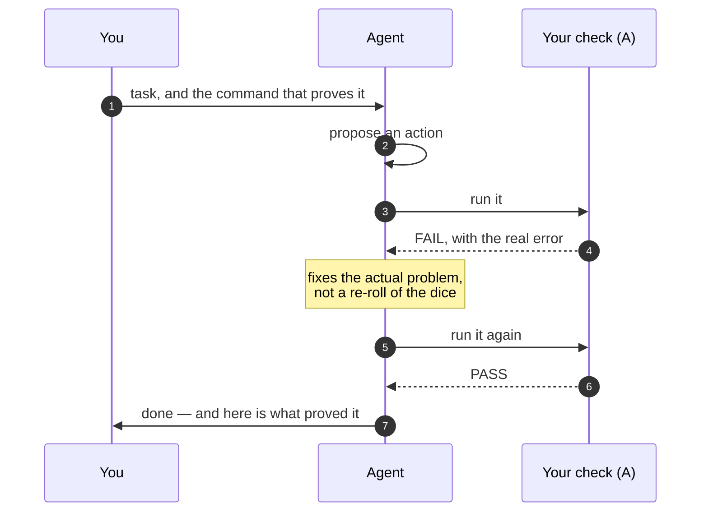
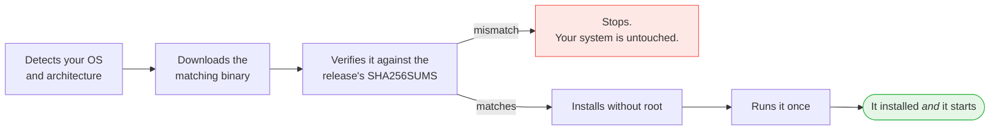
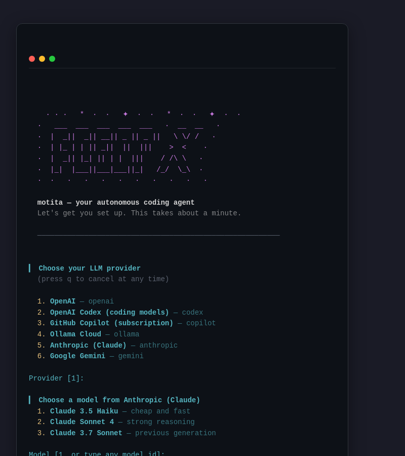
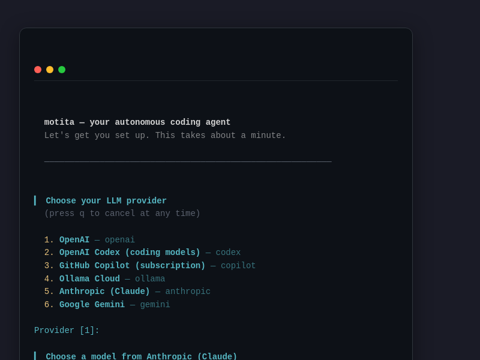
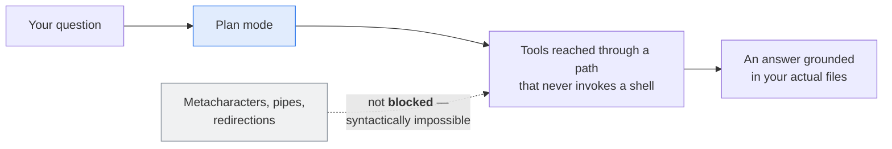
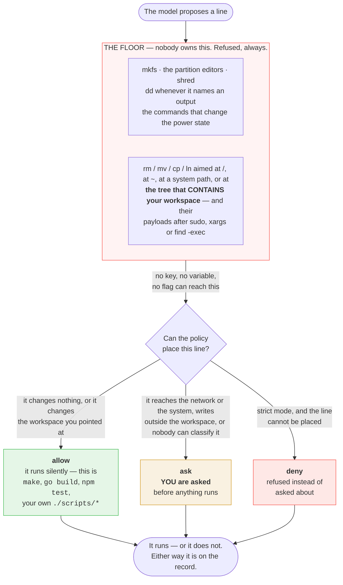
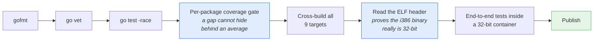

# Motita 🌟

**The AI agent that has to prove it finished.**

Every other agent asks you to trust it. motita doesn't ask — it runs a real
check, and only the check can declare the task done. If the check fails, the
agent gets the real error back and tries again. If it can't pass, it says so and
stops.

One static binary. No Docker. No dependencies. It runs on a 2008 netbook with
484 MB of RAM.

---

## The problem with every other agent

You give an AI agent a task. It says *"done"*. You check. It wasn't done.

Worse: it *sounded* done. Confident, detailed, plausible. So you shipped it.

That isn't a bug in one model — it's the architecture. When the model is both the
worker and the judge of its own work, "done" means "the model felt like
stopping". And a language model will always produce a sentence that sounds like
success, because producing plausible sentences is the one thing it is
guaranteed to do well.

## The model proposes, your code disposes

motita splits every task in three, and the model only ever gets to *propose*.


**The one rule that makes it work: the model can *propose* a `PASS`, but only
layer A can *declare* one.** With no anchor configured, the agent refuses to
start. There is no "trust me" mode — a `PASS` with nothing behind it is the exact
failure this architecture exists to prevent.

| Layer | What it is | Why it matters |
|---|---|---|
| **A · The anchor** | Deterministic code. Runs your command, checks the exit code, matches the output against a pattern, asserts your invariants. | It cannot be talked into a different answer. Fast, boring, predictable. |
| **B · The reasoning engine** | A hand-written client for OpenAI-compatible, Anthropic, Gemini, Codex, and Copilot APIs. | Point it at OpenAI, Codex, Ollama Cloud, Copilot, Groq, OpenRouter, DeepSeek, or your own box. Nothing else in the agent knows which. |
| **C · The sandbox** | Runs the proposed action in an ephemeral directory under real limits. | And it **tells you what it could not apply** instead of pretending the isolation is stronger than it is. |

## Why that changes what you get



**Retries that learn something.** When a check fails, the agent gets the failing
command, its real output, and the structured verdict back.

**Nothing is "working" because it sounded like it.** The end-to-end test asserts
the result **on the filesystem**, not in what the agent says about itself. The
simulated model in that test gets it wrong on purpose on the first attempt and
corrects itself on the second, so the whole recovery loop is exercised for real
on every commit.

**Your exit code means something.** `0` when every task passed its check, `1` when
any failed, `2` for a bad configuration. Drop it in cron or systemd and it behaves
like a program, not like a chatbot.

## It runs where nothing else runs

motita is written in **pure Go: standard library only, zero external
dependencies, no cgo**. `go.mod` has no `require` line. There is no `go.sum`,
nothing to vendor, nothing to patch.

The result is a **single static binary** — copy it to a machine over `scp`, walk
away, and it works. No Go toolchain, no runtime, no container, no dependency tree
you'll regret in two years.

| | |
|---|---|
| **Linux** | `386`, `amd64`, `arm` (ARMv7), `arm64` |
| **Windows** | `386`, `amd64`, `arm64` |
| **macOS** | `amd64`, `arm64` |
| **Published size** | 6.9 – 7.7 MB per binary (measured on all 9 targets with this toolchain) |

`386` is a **first-class target**, not an afterthought nobody tests. The
end-to-end suite builds the agent and runs it inside a real 32-bit container, so
what gets verified is the artifact you download. The screenshot at the top of this
page is that binary, running on 2008 hardware.

## Install

```sh
curl -fsSL https://raw.githubusercontent.com/madkoding/motita/main/scripts/install.sh | sh
```



That last step is the part most installers skip, and it's the one failure that
matters: a binary that installs but won't start.

Then:

```sh
motita
```

That's it. If no configuration exists, the wizard launches automatically —
no need to know about `-init`. It walks you through:

1. **Choose a provider**: OpenAI, OpenAI Codex, GitHub Copilot, Ollama Cloud,
   Anthropic (Claude), Google Gemini, or your Claude subscription through Claude Code.
2. **Choose a model**: each provider ships curated defaults, or type any model ID.
3. **Set the anchor**: the command that decides whether a task is really done.
   The third question is the one other tools never ask.
4. **Authenticate**: paste an API key, or **connect directly** — open a link in
   your browser and enter a one-time code. Direct login is available for
   Anthropic, Gemini, and Copilot, so you never handle an API key at all.



<sub>The first-run wizard: provider list, model selection, and the anchor question.
Runs automatically when no config is found.</sub>



<sub>For Anthropic, Gemini, and Copilot: connect with a link and a code,
no API key needed.</sub>

Your API key (or OAuth token) goes into a separate `0600` file, never into the
config, so the config can be committed and shared.

### Your Claude subscription, through Claude Code

The `claude-code` provider runs motita on your Claude Pro or Max plan by starting the
official `claude` CLI as its model. You need [Claude Code](https://code.claude.com/docs/en/setup)
installed and logged in once with `claude auth login`. motita never reads or stores those
credentials, and it clears `ANTHROPIC_API_KEY` and the other backend overrides from claude's
environment so your subscription login is the one that gets used. motita still runs its own
loop, tools and sandbox: claude only answers with text and tool calls.

```yaml
llm:
  provider: claude-code
  model: sonnet        # or opus, haiku, fable, or a full model id
```

`/models` lists the models your account offers, as claude's own picker does, and
`/models <id>` switches to one. `llm.reasoning` becomes claude's `--effort` (off switches
thinking off), and `llm.max_tokens` caps each answer. claude runs from one private, empty
directory in your user cache, so every turn can reuse the prompt cache. Set
`MOTITA_CLAUDE_BIN` if `claude` is not on your `PATH`.

## A terminal interface you'll actually want to use

Run it with no arguments and you get a full TUI: streaming answers with a
typewriter reveal, tab completion, a live model catalogue from your provider,
session context tracking, and mouse support. Written against the standard library
alone — it's the same binary, not a wrapper around something else.

**The same process is also a gateway.** It listens on **every interface** and enforces
**no origin rules** — the same posture as a machine with a fresh, empty firewall table:
everything is accepted until you add a rule. The terminal you are looking at is one of
its **clients**, so a web page or a phone can join the same conversation, with the same
procedure library and the same reward ledger. Narrow it by adding rules to
`gateway.allow`:

```yaml
gateway:
  allow: ["lan"]            # only the local network; everything else still gets in
  allow: ["lan", "!any"]    # the local network ONLY — usually what you want
  allow: ["!any"]           # this machine only
  allow: ["10.0.0.5"]       # one machine, everything else still gets in
  allow: ["!192.168.1.0/24"] # everything except one network
```

Rules are an ordered list, the first one that matches decides, and loopback is always
allowed — so a rule set can never lock you out of the machine you configured it on. The
token is what stands between the network and an agent that runs commands here; the rules
say where that token may come from. The supported way to reach a remote gateway without
exposing it at all is still a tunnel: `ssh -N -L 7477:127.0.0.1:7477 the-host`. There is
**no TLS** in this version, and the gateway says so at open time.

**The two halves come apart.** `-serve` runs the gateway and no interface; `-connect` runs the
interface and no gateway:

```bash
# on the machine that runs the commands
motita -serve -gateway 127.0.0.1:7477

# anywhere else — no sandbox, no reasoning engine, no agent in this process
motita -connect 127.0.0.1:7477 -tui
motita -connect 127.0.0.1:7477 -session s7f3a1c9e -tui
motita -connect 127.0.0.1:7477 -p "how many files are there?"
```

A process in `-connect` mode builds **no sandbox, no procedure library and no reasoning
engine** — all three belong to the machine running the gateway. That is what lets it run
where the agent could never run: a laptop, a phone, a tablet. Reach a gateway on another
host through a tunnel (`ssh -N -L 7477:127.0.0.1:7477 the-host`); there is no TLS in this
version.

Inside the interface, `/sessions` lists the conversations the gateway holds — marking the
one you are on and naming any with a run in flight — and `/attach <id>` moves to another
one. The token is **read** from `gateway.token`, never minted, and a `-session` the
gateway does not hold is refused at start with the list of the ones it does.

### The browser interface, from the same port

The gateway serves a web interface **from its own port** — no second server, no second
address, and no CORS, because the page and the API share an origin. It comes up with the
gateway (`gateway.webui: false` turns it off):

```
$ motita gateway start
the gateway is running at http://127.0.0.1:7477 (pid 4211, v0.5.0-72-gcadb33f)

this gateway is listening on every interface (port 7477): any machine that can
reach this host may connect, subject to the rules below.
no origin rules are set, so EVERY origin is accepted (gateway.allow is empty).
add a rule to gateway.allow to narrow it: "lan", an address, a network, or
"!any" for this machine only.
there is no TLS, so the token travels in clear text to every one of them.

the interface is at http://127.0.0.1:7477/#t=<token>
open that link once: the page trades the fragment for a cookie and drops it

from another machine, use whichever of these reaches this host - same port,
same fragment, and the link above only works on this machine:
  http://192.168.1.20:7477/#t=<token>
```

Notice the two answers: **where the socket is open** and **who may use it**. The link is a
loopback address because a wildcard bind has to be normalised into something a client can
actually dial — which is exactly why the exposure is reported separately rather than read
out of the link.

The second list exists for the same reason. The address a *remote* browser needs cannot be
derived from the listener, and asking the operator to substitute their own address is a
networking question asked at the moment they are least equipped to answer it — the symptom
being a page that reports `not connected` with nothing to explain why. So the addresses this
host actually answers on are printed instead, IPv4 first, with the container-only bridges
left out because nothing outside the machine can reach them.

The token rides in the URL **fragment**, which a browser never sends to the server, and
the page immediately trades it for an `HttpOnly`, `SameSite=Strict` cookie whose value is
an **HMAC of the token** rather than the token itself. So a cookie lifted from a browser
is not a reusable credential, nothing is stored server-side, and **rotating the token
invalidates every cookie** with nothing to clean up. The page is served without a token —
like a login form — and therefore holds no secret at all.

The token is **not a setting to configure**. Nothing in the YAML mints it and nothing needs
to: the gateway generates one the first time it starts, keeps it in `gateway.token_file`
(mode 0600) and prints it inside the link. So opening the plain address — the IP with no
`#t=…` — lands on a page that reports `not connected`, and the honest reading of that is
"open the link, not the address", never "go and configure a token". The page says exactly
that, because the first reading sends people hunting for a key that was never meant to exist.

The page paints the conversation the gateway already has, streams a turn live, resumes
from the last event it saw when the connection drops, and shows an approval with the
command **whole**. It is compiled into the binary: **+28 KB** measured, against 1.16 MB of
margin under the size gate, and a test fails if the assets outgrow their budget.

### More than one conversation at a time

A gateway holds **several conversations at once**, each with its own run slot, its
own transcript, and its own approval prompt. Two clients working at the same time
do not wait for each other, and a second run in the *same* conversation is refused
with a `409` instead of being queued: one conversation has one slot, and saying so
is more useful than pretending otherwise.

Every conversation endpoint names the conversation it is about — the default one
included, because there is no second way in:

```sh
curl -H "Authorization: Bearer $TOKEN" http://127.0.0.1:7477/v1/sessions
# {"sessions":[{"id":"default","created":"...","last_used":"...","running":false}]}

curl -X POST -H "Authorization: Bearer $TOKEN" http://127.0.0.1:7477/v1/sessions
# {"id":"s7f3a1c9e"} — now drive /v1/sessions/s7f3a1c9e/task

curl -H "Authorization: Bearer $TOKEN" http://127.0.0.1:7477/v1/sessions/default/config
curl -X DELETE -H "Authorization: Bearer $TOKEN" \
  http://127.0.0.1:7477/v1/sessions/s7f3a1c9e
```

| Endpoint | What it does |
|---|---|
| `GET /v1/health` | the only one that needs no token: liveness |
| `GET` `POST /v1/sessions` | list what is held, or open one more |
| `DELETE /v1/sessions/{id}` | close one and get its memory back |
| `GET /v1/sessions/{id}` | that conversation's figures, `running` included |
| `POST /v1/sessions/{id}/task` | run a task, streamed as server-sent events |
| `POST /v1/sessions/{id}/plan` | the same, read-only |
| `POST /v1/sessions/{id}/runs/approval` | answer a pending confirmation |
| `GET /v1/sessions/{id}/report` | the conversation so far |
| `GET /v1/sessions/{id}/config` `/models` `/reward` `/questions` | the read-only views |
| `POST /v1/sessions/{id}/reasoning` `/model` `/verdict` `/reset` | change the budget or the model, grade a turn, start over |

The default conversation belongs to the process that started the gateway: closing it
is refused, because that process would be left talking to a conversation that no
longer exists. `gateway.max_sessions` caps how many a process will hold (`0` means
the built-in default); the ceiling is there so a client that forgets to close what
it opened cannot turn the agent into a memory leak.

**The port is 7477 by default**, chosen because IANA leaves it unassigned, nothing
well known uses it, and it sits below the ephemeral range a Linux box hands out by
default. Some hosts widen that range (this one goes down to 1024), in which case a
fixed port can occasionally collide with an outgoing connection — if a start fails
with `address already in use`, pick another with `-gateway 127.0.0.1:<port>`.

It is a **fixed** port rather than an ephemeral one because the gateway can now be a
service that outlives the process that started it, and a later process has to be able to
find it. An ephemeral port is chosen at bind time: it exists in the memory of one process
and nowhere else.

That is also why `motita gateway start` exists:

```sh
motita gateway start    # the gateway as a service, in the background
motita gateway status   # is one running, and where?
motita gateway stop     # stop the one the service file names
```

And why plain `motita` now **attaches** instead of always starting its own:

| Situation | What you get |
|---|---|
| a gateway is already running | the interface connects to it and shuts nothing down — a service you started on purpose is not killed because a terminal connected |
| nothing is running | one is brought up for this interface, in-process, and goes away with it |
| `-gateway off` | no gateway: the direct path, as before |

The interface's gateway is in-process on purpose, which is the opposite of what
`gateway start` does: the service exists to outlive its shell, while this one exists *for*
the interface and must die with it however the process dies. A re-executed child would
survive a `SIGKILL` and leak. Two terminals against one service are not two agents on two
ports — they are **two views of one conversation**.

| Command | What it does |
|---|---|
| `/task` `/plan` | switch between doing work and read-only exploration |
| `/models` `/models <id>` | your provider, your key status and the models it really publishes; with an id, switch to that model for this session |
| `/reasoning` | cycle the thinking budget |
| `/good` `/bad` | tell the agent how a turn went |
| `/value` | see what it has learned from those verdicts |
| `/session` `/find` `/new` `/help` | context, search, fresh start, help |

**Plan mode is structurally read-only**, and that word is doing real work:



Pipes and shell metacharacters aren't filtered out in plan mode: there is nothing
to filter *and* nothing to bypass, because the shell is never in the path.

## It learns from you, not from a retraining pipeline

motita keeps a **library of procedures**: documents describing how a kind of
work is done — the steps, the commands that work, the pitfalls someone already
paid for. The model looks one up when it needs it, and **writes a new one when it
learns something**. They're files, so you can read them, fix them, and version
them. The built-ins ship inside the binary, so a fresh install starts with a
library instead of an empty shelf.

Then `/good` and `/bad` land on the procedures that turn actually used, and the
library is searched by what has worked out before. No fine-tuning, no API, no
extra bill. Just a ledger next to a shelf.

## Guardrails that can't be switched off

There are two layers, and only one of them is yours.



The subtle middle row is the whole design. `make`, `go build`, `npm test`,
`python3 build.py` and your own `./scripts/*` are recognised as the project's own
work and run **without a question** — because a policy that asks about those gets
switched off in a week, and then it protects nothing. What gets asked about is
what nobody can predict: an infrastructure tool, a binary nobody knows, an
interpreter handed code inline, or a script from outside the workspace.

There is one asymmetry in that row worth knowing before you meet it:
`./scripts/deploy.sh` runs silently, but `sh scripts/deploy.sh` is asked about.
Handing the same file to a shell hides it from the classifier — `sh -c 'ls'` and
`sh -c 'rm -rf /'` have the same shape — so the cautious answer is to ask. Name
the program directly and the policy can see it is yours.

There is no YAML key, no environment variable and no flag that relaxes the floor.
**That's the point.** A guardrail an operator can switch off is a guardrail that
*will* be switched off — during the incident it was meant for, by whoever wants
the task to finish.

And it isn't a claim on a slide: a test in the repository asserts the sentences
above against the classifier's real verdicts, so this page cannot drift away from
the behaviour.

## Why you can believe the numbers

This is tested the way you'd test something you were about to bet on.

| | |
|---|---|
| **Statement coverage** | **100% in every package that ships** — 20 of 20 (`./internal/... ./cmd/...`), checked package by package so a gap can't hide behind an average. `tools/` holds the CI harnesses and is counted separately |
| **Test functions** | 1,763 across 110 files |
| **Code vs tests** | 20,434 lines of Go · 41,402 lines of test |
| **External dependencies** | 0 |
| **Platforms CI builds** | 9 — every one gets `-version` run in its own container on Linux, and a PE/Mach-O header + size check on Windows and macOS |

That coverage number isn't a badge. It's the mechanism that found the bugs
documented in the reference: the `RLIMIT_CPU` that never fired, the process group
that kept a 1-second deadline waiting for five, the sandbox directory that got
deleted before the validator could look inside it. Every one of them is a test
now.



## Three workloads it's built for

| | |
|---|---|
| **Development** | task in a file → LLM → networkless sandbox → **`go test` + `go vet` + `gofmt` as the anchor** → commit |
| **Data analysis** | task from an API → isolated analysis → **report invariants as the anchor** → publish the result |
| **Automation** | file queue → bounded script (256 MB, 30 s CPU, no network) → **effect check as the anchor** → notify |

Everything is configured in YAML, validated without running anything
(`-validate-config`), and every setting has a `MOTITA_*` environment override
for containers and secrets.

---

## Going deeper

**[madkoding.github.io/motita](https://madkoding.github.io/motita/)** — the same
pitch as a landing page, with the architecture as an interactive diagram you can
explore: switch themes, trace a relationship, export it as SVG or PNG.

The prose version, and the engineering in full:

**[docs/REFERENCE.md](docs/REFERENCE.md)** — the architecture in detail, the
sandboxing layers and why the limits are applied by the shell rather than the
agent, the guardrail floor command by command, every configuration key, the
prompt variables, the JSON logging format, the i386 troubleshooting table, and
how to extend the agent with your own task source, provider or final action.

**[docs/TUI-DESIGN-REVIEW.md](docs/TUI-DESIGN-REVIEW.md)** — how the interface
was designed against the standard library alone.

**MIT licensed.** Take it, ship it, run it on hardware everyone else wrote off.

```sh
curl -fsSL https://raw.githubusercontent.com/madkoding/motita/main/scripts/install.sh | sh
```
