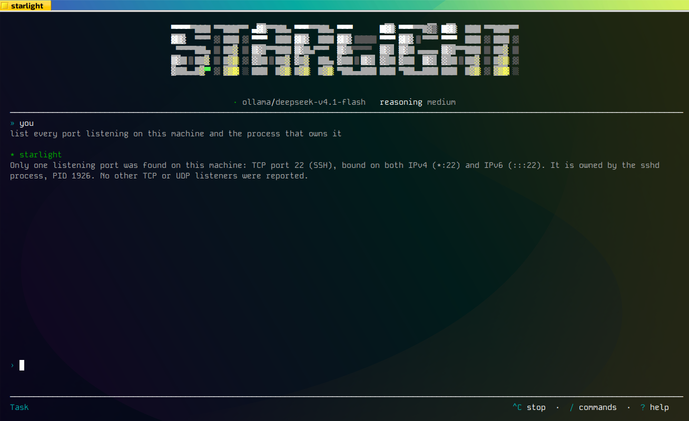

# starlight 🌟

**The AI agent that has to prove it finished.**

Every other agent asks you to trust it. starlight doesn't ask — it runs a real
check, and only the check can declare the task done. If the check fails, the
agent gets the real error back and tries again. If it can't pass, it says so and
stops.

One static binary. No Docker. No dependencies. It runs on a 2008 netbook with
484 MB of RAM.



<sub>A real session, not a mockup: an Acer Aspire One (Atom N270, 484 MB RAM,
Ubuntu 11.04 / kernel 2.6.38) answering a question by running commands and
reporting what it actually found.</sub>

---

## The problem with every other agent

You give an AI agent a task. It says *"done"*. You check. It wasn't done.

Worse: it *sounded* done. Confident, detailed, plausible. So you shipped it.

That isn't a bug in one model — it's the architecture. When the model is both the
worker and the judge of its own work, "done" means "the model felt like
stopping". And a language model will always produce a sentence that sounds like
success, because producing plausible sentences is the one thing it is
guaranteed to do well.

## The fix: the model proposes, a validator disposes

starlight splits the job in three. The model only ever gets to *propose*.

```
                    ┌──────────────────────────────────────────────┐
   TASK ──────────► │  B · THE REASONING ENGINE                    │
                    │  reads the task, proposes an action          │
                    │  ── it never gets to declare success ──      │
                    └───────────────────┬──────────────────────────┘
                                        │
                                        ▼
                    ┌──────────────────────────────────────────────┐
                    │  C · THE SANDBOX                             │
                    │  runs it in its own directory, under real    │
                    │  limits: memory, CPU, time, no network       │
                    └───────────────────┬──────────────────────────┘
                                        │
                                        ▼
                    ┌──────────────────────────────────────────────┐
                    │  A · THE ANCHOR        ← your code, not AI   │
                    │  runs your check: exit code, output regex,   │
                    │  your invariants. No opinions.                │
                    └───────────────────┬──────────────────────────┘
                                        │
                        ┌───────────────┴───────────────┐
                        ▼                               ▼
                    ── FAIL ──                      ── PASS ──
                        │                               │
        the failing command, its real          the final action runs:
        output and the verdict go back         commit · publish · notify
        to the model, which retries                    │
                        │                               ▼
                        └──► (out of retries) ──►  ESCALATE, and say so
```

**The one rule that makes it work:** the model can *propose* a `PASS`, but only
layer A can *declare* one. With no anchor configured, the agent refuses to start.

**Layer A — the anchor** is deterministic code, not AI. It runs your command and
checks the exit code, the output against a regex, and your business invariants.
It has no opinions. It is fast, boring and predictable.

And it holds a veto that cannot be bought: **with no anchor configured, the agent
refuses to start at all.** There is no "trust me" mode. A `PASS` with nothing
behind it is the exact failure this architecture exists to prevent.

**Layer B — the reasoning engine** is a hand-written client for OpenAI-compatible,
Anthropic and Gemini APIs. Point it at OpenAI, Ollama Cloud, Groq, OpenRouter,
DeepSeek, or your own self-hosted box. The rest of the agent doesn't know or care
which one is behind it.

**Layer C — the sandbox** runs the proposed action in its own ephemeral directory
under real limits, and **tells you the truth about what it could not apply**
instead of quietly pretending the isolation is stronger than it is.

## Why that changes what you get

**Retries that learn something.** When a check fails, the agent gets the failing
command, its real output, and the structured verdict back. It fixes the actual
problem instead of re-rolling the dice.

**Nothing is "working" because it sounded like it.** The end-to-end test asserts
the result **on the filesystem**, not in what the agent says about itself. The
simulated model in that test gets it wrong on purpose on the first attempt and
corrects itself on the second, so the whole recovery loop is exercised for real on
every commit.

**Your exit code means something.** `0` when every task passed its check, `1` when
any failed (with the reason in the error message itself), `2` for a bad
configuration. Drop it in cron or systemd and it behaves like a program, not like
a chatbot.

## It runs where nothing else runs

starlight is written in **pure Go: standard library only, zero external
dependencies, no cgo**. `go.mod` has no `require` line. There is no `go.sum`,
nothing to vendor, nothing to patch.

The result is a **single static binary** — copy it to a machine over `scp`, walk
away, and it works. No Go toolchain, no runtime, no container, no dependency tree
you'll regret in two years.

| | |
|---|---|
| **Linux** | `386`, `amd64`, `arm` (ARMv7), `arm64` |
| **Windows** | `386`, `amd64`, `arm64` |
| **macOS** | `amd64`, `arm64` |
| **Published size** | 6.6 – 7.1 MB per binary |

`386` is a **first-class target**, not an afterthought nobody tests. The
end-to-end suite builds the agent and runs it inside a real 32-bit container, so
what gets verified is the artifact you download. The screenshot at the top of this
page is that binary, running on 2008 hardware.

## Install

```sh
curl -fsSL https://raw.githubusercontent.com/madkoding/starlight/main/scripts/install.sh | sh
```

It detects your system, downloads the matching binary, **verifies it against the
release's `SHA256SUMS`**, installs without needing root, and then — the part most
installers skip — **runs it once**, because a binary that installs but won't start
is the one failure that matters. A corrupted download leaves your system exactly
as it was.

Then:

```sh
starlight -init
```

The wizard asks for a provider, a model, and **the check that decides whether a
task is really done**. The third question is the one that matters, and it's the
one other tools never ask. Your API key goes into a separate `0600` file, never
into the config, so the config can be committed and shared.

## A terminal interface you'll actually want to use

Run it with no arguments and you get a full TUI: streaming answers with a
typewriter reveal, tab completion, a live model catalogue from your provider,
session context tracking, and mouse support. Written against the standard library
alone — it's the same binary, not a wrapper around something else.

| Command | What it does |
|---|---|
| `/task` `/plan` | switch between doing work and read-only exploration |
| `/models` | your provider, your key status, and the models it really publishes |
| `/reasoning` | cycle the thinking budget |
| `/good` `/bad` | tell the agent how a turn went |
| `/value` | see what it has learned from those verdicts |
| `/session` `/find` `/new` `/help` | context, search, fresh start, help |

**Plan mode is structurally read-only.** It explores and proposes, calling tools
through a path that never invokes a shell — so pipes, redirections and shell
metacharacters aren't blocked, they're *syntactically impossible*. Ask a question,
get an answer grounded in your actual files.

## It learns from you, not from a retraining pipeline

starlight keeps a **library of procedures**: documents describing how a kind of
work is done — the steps, the commands that work, the pitfalls someone already
paid for. The model looks one up when it needs it, and **writes a new one when it
learns something**. They're files, so you can read them, fix them, and version
them. The built-ins ship inside the binary, so a fresh install starts with a
library instead of an empty shelf.

Then `/good` and `/bad` land on the procedures that turn actually used, and the
library is searched by what has worked out before. No fine-tuning, no API, no
extra bill. Just a ledger next to a shelf.

## Guardrails that can't be switched off

There are two layers, and only one of them is yours.

```
   the model proposes a line
              │
              ▼
   ╔══════════════════════════════════════════════════════════════╗
   ║  THE FLOOR  —  nobody owns this. Refused, always.            ║
   ║  mkfs · the partition editors · dd with an output · shred    ║
   ║  the power verbs · rm/mv/cp/ln aimed at /, ~, a system path, ║
   ║  or the tree that CONTAINS your workspace                    ║
   ╚══════════════════════════════════════════════════════════════╝
              │  no key, no variable, no flag can reach this
              ▼
   ╔══════════════════════════════════════════════════════════════╗
   ║  THE CONFIRMATION LAYER  —  yours, in `agent.policy`         ║
   ║                                                              ║
   ║   allow  │  it changes nothing, or it changes the            ║
   ║          │  workspace you pointed the agent at               ║
   ║   ───────┼────────────────────────────────────────────────   ║
   ║   ask    │  it reaches the network or the system, writes      ║
   ║          │  outside the workspace, or is something nobody     ║
   ║          │  can classify → YOU are asked                     ║
   ║   ───────┼────────────────────────────────────────────────   ║
   ║   deny   │  strict mode: what cannot be classified is         ║
   ║          │  refused instead of asked about                    ║
   ╚══════════════════════════════════════════════════════════════╝
              │
              ▼
        it runs, or it does not — and either way it is on the record
```

The subtle middle row is the whole design. `make`, `go build`, `npm test`,
`python3 build.py` and your own `./scripts/*` are recognised as the project's own
work and run **without a question** — because a policy that asks about those gets
switched off in a week, and then it protects nothing. What gets asked about is
what nobody can predict: an infrastructure tool, a binary nobody knows, an
interpreter handed code inline or a script from outside the workspace.

There is no YAML key, no environment variable and no flag that relaxes it.
**That's the point.** A guardrail an operator can switch off is a guardrail that
*will* be switched off — during the incident it was meant for, by whoever wants
the task to finish.

And it isn't a claim on a slide: a test in the repository asserts every sentence
above against the classifier's real verdicts, so this page cannot drift away from
the behaviour.

## Why you can believe the numbers

This is tested the way you'd test something you were about to bet on.

| | |
|---|---|
| **Statement coverage** | **100% in every package that ships** — 22 of 22, checked package by package so a gap can't hide behind an average |
| **Test functions** | 1,787 across 109 files |
| **Code vs tests** | 20,306 lines of Go · 41,565 lines of test |
| **External dependencies** | 0 |
| **Platforms CI builds and verifies** | 9 |

That coverage number isn't a badge. It's the mechanism that found the bugs
documented in the reference: the `RLIMIT_CPU` that never fired, the process group
that kept a 1-second deadline waiting for five, the sandbox directory that got
deleted before the validator could look inside it. Every one of them is a test
now.

CI runs `gofmt`, `vet` and `-race`, enforces the per-package coverage gate,
cross-builds all nine targets, **reads the ELF header to prove the i386 binary
really is 32-bit**, and runs the end-to-end tests inside a 32-bit container before
publishing anything.

## Three workloads it's built for

| | |
|---|---|
| **Development** | task in a file → LLM → networkless sandbox → **`go test` + `go vet` + `gofmt` as the anchor** → commit |
| **Data analysis** | task from an API → isolated analysis → **report invariants as the anchor** → publish the result |
| **Automation** | file queue → bounded script (256 MB, 30 s CPU, no network) → **effect check as the anchor** → notify |

Everything is configured in YAML, validated without running anything
(`-validate-config`), and every setting has a `STARLIGHT_*` environment override
for containers and secrets.

---

## Going deeper

This page is the pitch. The engineering lives in full somewhere else:

**[docs/REFERENCE.md](docs/REFERENCE.md)** — the architecture, the sandboxing
layers and why the limits are applied by the shell rather than the agent, the
guardrail floor in detail, every configuration key, the prompt variables, the JSON
logging format, the i386 troubleshooting table, and how to extend the agent with
your own task source, provider or final action.

**MIT licensed.** Take it, ship it, run it on hardware everyone else wrote off.

```sh
curl -fsSL https://raw.githubusercontent.com/madkoding/starlight/main/scripts/install.sh | sh
```
