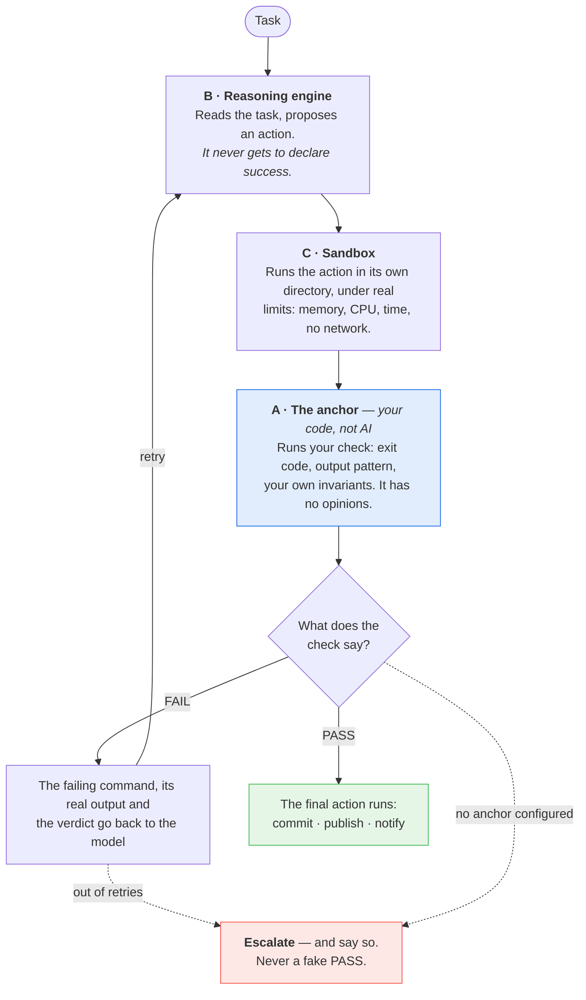
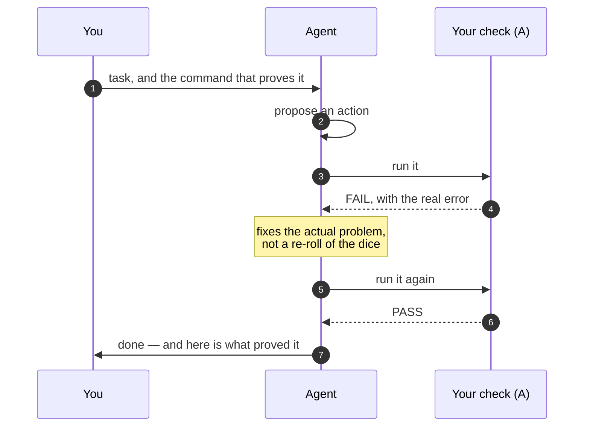
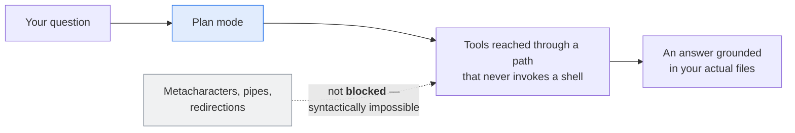
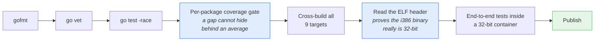

# starlight 🌟

**The AI agent that has to prove it finished.**

Every other agent asks you to trust it. starlight doesn't ask — it runs a real
check, and only the check can declare the task done. If the check fails, the
agent gets the real error back and tries again. If it can't pass, it says so and
stops.

One static binary. No Docker. No dependencies. It runs on a 2008 netbook with
484 MB of RAM.


<sub>A real session, not a mockup: an Acer Aspire One (Atom N270, 484 MB RAM,
Ubuntu 11.04 / kernel 2.6.38) answering a question by running commands and
reporting what it actually found.</sub>

---

## The problem with every other agent

You give an AI agent a task. It says *"done"*. You check. It wasn't done.

Worse: it *sounded* done. Confident, detailed, plausible. So you shipped it.

That isn't a bug in one model — it's the architecture. When the model is both the
worker and the judge of its own work, "done" means "the model felt like
stopping". And a language model will always produce a sentence that sounds like
success, because producing plausible sentences is the one thing it is
guaranteed to do well.

## The model proposes, your code disposes

starlight splits every task in three, and the model only ever gets to *propose*.



**The one rule that makes it work: the model can *propose* a `PASS`, but only
layer A can *declare* one.** With no anchor configured, the agent refuses to
start. There is no "trust me" mode — a `PASS` with nothing behind it is the exact
failure this architecture exists to prevent.

| Layer | What it is | Why it matters |
|---|---|---|
| **A · The anchor** | Deterministic code. Runs your command, checks the exit code, matches the output against a pattern, asserts your invariants. | It cannot be talked into a different answer. Fast, boring, predictable. |
| **B · The reasoning engine** | A hand-written client for OpenAI-compatible, Anthropic and Gemini APIs. | Point it at OpenAI, Ollama Cloud, Groq, OpenRouter, DeepSeek, or your own box. Nothing else in the agent knows which. |
| **C · The sandbox** | Runs the proposed action in an ephemeral directory under real limits. | And it **tells you what it could not apply** instead of pretending the isolation is stronger than it is. |

## Why that changes what you get



**Retries that learn something.** When a check fails, the agent gets the failing
command, its real output, and the structured verdict back.

**Nothing is "working" because it sounded like it.** The end-to-end test asserts
the result **on the filesystem**, not in what the agent says about itself. The
simulated model in that test gets it wrong on purpose on the first attempt and
corrects itself on the second, so the whole recovery loop is exercised for real
on every commit.

**Your exit code means something.** `0` when every task passed its check, `1` when
any failed, `2` for a bad configuration. Drop it in cron or systemd and it behaves
like a program, not like a chatbot.

## It runs where nothing else runs

starlight is written in **pure Go: standard library only, zero external
dependencies, no cgo**. `go.mod` has no `require` line. There is no `go.sum`,
nothing to vendor, nothing to patch.

The result is a **single static binary** — copy it to a machine over `scp`, walk
away, and it works. No Go toolchain, no runtime, no container, no dependency tree
you'll regret in two years.

| | |
|---|---|
| **Linux** | `386`, `amd64`, `arm` (ARMv7), `arm64` |
| **Windows** | `386`, `amd64`, `arm64` |
| **macOS** | `amd64`, `arm64` |
| **Published size** | 6.6 – 7.1 MB per binary |

`386` is a **first-class target**, not an afterthought nobody tests. The
end-to-end suite builds the agent and runs it inside a real 32-bit container, so
what gets verified is the artifact you download. The screenshot at the top of this
page is that binary, running on 2008 hardware.

## Install

```sh
curl -fsSL https://raw.githubusercontent.com/madkoding/starlight/main/scripts/install.sh | sh
```


That last step is the part most installers skip, and it's the one failure that
matters: a binary that installs but won't start.

Then:

```sh
starlight -init
```

The wizard asks for a provider, a model, and **the check that decides whether a
task is really done**. The third question is the one other tools never ask. Your
API key goes into a separate `0600` file, never into the config, so the config can
be committed and shared.

## A terminal interface you'll actually want to use

Run it with no arguments and you get a full TUI: streaming answers with a
typewriter reveal, tab completion, a live model catalogue from your provider,
session context tracking, and mouse support. Written against the standard library
alone — it's the same binary, not a wrapper around something else.

| Command | What it does |
|---|---|
| `/task` `/plan` | switch between doing work and read-only exploration |
| `/models` | your provider, your key status, and the models it really publishes |
| `/reasoning` | cycle the thinking budget |
| `/good` `/bad` | tell the agent how a turn went |
| `/value` | see what it has learned from those verdicts |
| `/session` `/find` `/new` `/help` | context, search, fresh start, help |

**Plan mode is structurally read-only**, and that word is doing real work:



Pipes and shell metacharacters aren't filtered out in plan mode: there is nothing
to filter *and* nothing to bypass, because the shell is never in the path.

## It learns from you, not from a retraining pipeline

starlight keeps a **library of procedures**: documents describing how a kind of
work is done — the steps, the commands that work, the pitfalls someone already
paid for. The model looks one up when it needs it, and **writes a new one when it
learns something**. They're files, so you can read them, fix them, and version
them. The built-ins ship inside the binary, so a fresh install starts with a
library instead of an empty shelf.

Then `/good` and `/bad` land on the procedures that turn actually used, and the
library is searched by what has worked out before. No fine-tuning, no API, no
extra bill. Just a ledger next to a shelf.

## Guardrails that can't be switched off

There are two layers, and only one of them is yours.


The subtle middle row is the whole design. `make`, `go build`, `npm test`,
`python3 build.py` and your own `./scripts/*` are recognised as the project's own
work and run **without a question** — because a policy that asks about those gets
switched off in a week, and then it protects nothing. What gets asked about is
what nobody can predict: an infrastructure tool, a binary nobody knows, an
interpreter handed code inline, or a script from outside the workspace.

There is one asymmetry in that row worth knowing before you meet it:
`./scripts/deploy.sh` runs silently, but `sh scripts/deploy.sh` is asked about.
Handing the same file to a shell hides it from the classifier — `sh -c 'ls'` and
`sh -c 'rm -rf /'` have the same shape — so the cautious answer is to ask. Name
the program directly and the policy can see it is yours.

There is no YAML key, no environment variable and no flag that relaxes the floor.
**That's the point.** A guardrail an operator can switch off is a guardrail that
*will* be switched off — during the incident it was meant for, by whoever wants
the task to finish.

And it isn't a claim on a slide: a test in the repository asserts the sentences
above against the classifier's real verdicts, so this page cannot drift away from
the behaviour.

## Why you can believe the numbers

This is tested the way you'd test something you were about to bet on.

| | |
|---|---|
| **Statement coverage** | **100% in every package that ships** — 22 of 22, checked package by package so a gap can't hide behind an average |
| **Test functions** | 1,789 across 110 files |
| **Code vs tests** | 20,306 lines of Go · 41,726 lines of test |
| **External dependencies** | 0 |
| **Platforms CI builds and verifies** | 9 |

That coverage number isn't a badge. It's the mechanism that found the bugs
documented in the reference: the `RLIMIT_CPU` that never fired, the process group
that kept a 1-second deadline waiting for five, the sandbox directory that got
deleted before the validator could look inside it. Every one of them is a test
now.



## Three workloads it's built for

| | |
|---|---|
| **Development** | task in a file → LLM → networkless sandbox → **`go test` + `go vet` + `gofmt` as the anchor** → commit |
| **Data analysis** | task from an API → isolated analysis → **report invariants as the anchor** → publish the result |
| **Automation** | file queue → bounded script (256 MB, 30 s CPU, no network) → **effect check as the anchor** → notify |

Everything is configured in YAML, validated without running anything
(`-validate-config`), and every setting has a `STARLIGHT_*` environment override
for containers and secrets.

---

## Going deeper

**[madkoding.github.io/starlight](https://madkoding.github.io/starlight/)** — the same
pitch as a landing page, with the architecture as an interactive diagram you can
explore: switch themes, trace a relationship, export it as SVG or PNG.

The prose version, and the engineering in full:

**[docs/REFERENCE.md](docs/REFERENCE.md)** — the architecture in detail, the
sandboxing layers and why the limits are applied by the shell rather than the
agent, the guardrail floor command by command, every configuration key, the
prompt variables, the JSON logging format, the i386 troubleshooting table, and
how to extend the agent with your own task source, provider or final action.

**[docs/TUI-DESIGN-REVIEW.md](docs/TUI-DESIGN-REVIEW.md)** — how the interface
was designed against the standard library alone.

**MIT licensed.** Take it, ship it, run it on hardware everyone else wrote off.

```sh
curl -fsSL https://raw.githubusercontent.com/madkoding/starlight/main/scripts/install.sh | sh
```
