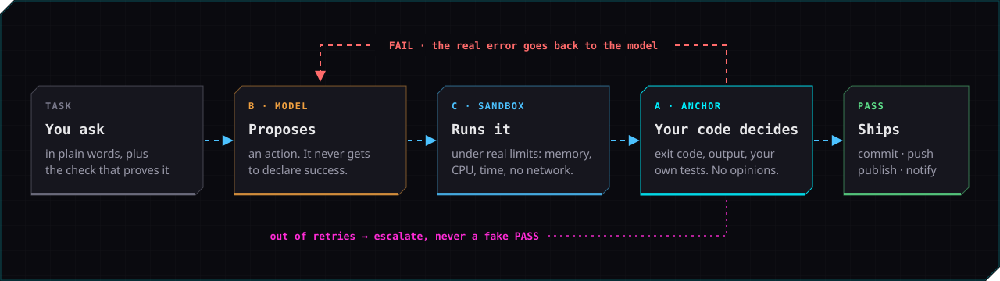
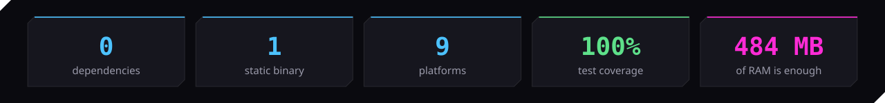
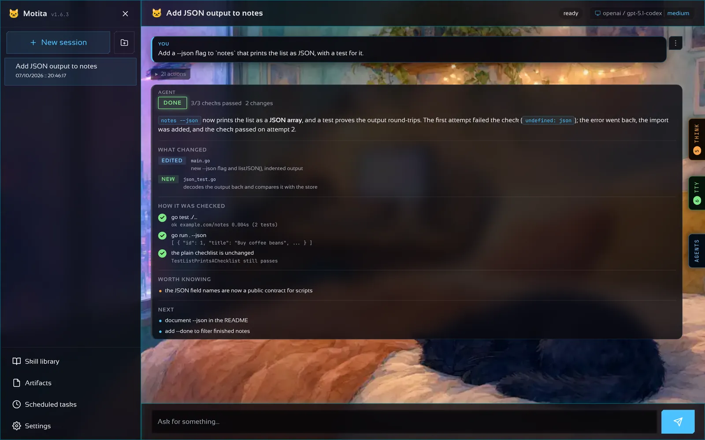

<div align="center">



<br>

[](https://github.com/madkoding/motita/releases/latest)
[](https://github.com/madkoding/motita/actions/workflows/ci.yml)
[](go.mod)
[](LICENSE)

**[Website](https://madkoding.github.io/motita/)** ·
**[Full guide](docs/GUIDE.md)** ·
**[Reference](docs/REFERENCE.md)** ·
**[Releases](https://github.com/madkoding/motita/releases)**

</div>

---

## ⚡ Install

```sh
curl -fsSL https://madkoding.github.io/motita/install.sh | sh
```

```powershell
irm https://madkoding.github.io/motita/install.ps1 | iex   # Windows
```

Then just run **`motita`**. A 5-step setup picks your provider, model and the check that
proves a task is done. The installer verifies the binary against `SHA256SUMS` and needs no root.

## 🧭 How it works



> **The model can _propose_ a `PASS`. Only your check can _declare_ one.**
> No check behind it, no `PASS`. There is no "trust me" mode.



## ✨ Why motita

| | |
|---|---|
| 🎯 **Proof, not vibes** | Done means your tests, linter or own command passed. It detects the gate from a `Makefile`, `go.mod`, `package.json`, `Cargo.toml` or `pytest`. |
| 🔁 **Retries that learn** | A failure goes back to the model with the real command output, not a re-roll of the dice. |
| 🔑 **Bring your own model** | OpenAI, Codex, Claude, Gemini, Copilot, Qwen, Ollama, Groq, OpenRouter, DeepSeek. Use an API key or the subscription you already pay for. |
| 🧱 **Real sandbox** | Memory, CPU, time and network limits, and it tells you what it could not enforce. |
| 🤖 **Agents in parallel** | Split a big job across background agents, each on its own git branch, with time and token cost per agent. |
| 🛡️ **Guardrails always on** | `rm -rf /`, `mkfs`, `dd` to a device and friends are refused, even through `sudo`, `xargs` or `sh -c`. |
| 🪶 **Runs anywhere** | Pure Go, one static binary. Linux, macOS, Windows, 32-bit included. Works on a 2008 netbook. |

## 🖥️ Terminal and browser, same process

<table>
<tr>
<td width="50%"></td>
<td width="50%"></td>
</tr>
<tr>
<td align="center"><sub><b>TUI</b> · <code>Tab</code> switches Task / Plan, <code>/</code> opens commands</sub></td>
<td align="center"><sub><b>Web UI</b> · served by the gateway on <code>127.0.0.1:7477</code></sub></td>
</tr>
</table>

Join the same conversation from a laptop or a phone through an SSH tunnel:
`motita -connect 127.0.0.1:7477 -tui`. English and Spanish built in (`/language es`).

## 📚 Go deeper

| | |
|---|---|
| 📖 **[Full guide](docs/GUIDE.md)** | Providers and logins, the gateway, sessions, git hosts, background agents, guardrails, testing |
| 🔧 **[Reference](docs/REFERENCE.md)** | Every config key, sandbox layers, logging format, extending the agent |
| 🌐 **[Website](https://madkoding.github.io/motita/)** | Live demo and interactive architecture diagram |
| 🤝 **[Contributing](CONTRIBUTING.md)** · 🔒 **[Security](SECURITY.md)** | How to help and how to report a vulnerability |

<div align="center">
<br>
<sub>Free software under <a href="LICENSE">GPL-3.0-or-later</a> · © 2026 madkoding · Conventional Commits drive every release</sub>
</div>
