# Motita 🌟

**The AI agent that has to prove it finished.**

Every other agent asks you to trust it. motita doesn't ask — it runs a real
check, and only the check can declare the task done. If the check fails, the
agent gets the real error back and tries again. If it can't pass, it says so and
stops.

One static binary. No Docker. No dependencies. It runs on a 2008 netbook with
484 MB of RAM.

Bring your own model: an API key, or a subscription you already pay for (ChatGPT,
GitHub Copilot, Claude, Qwen). Give it a big job and it can split the work across
background agents, each on its own git branch, and show you what every one of them is
doing, for how long and at what cost in tokens.

---

## The problem with every other agent

You give an AI agent a task. It says *"done"*. You check. It wasn't done.

Worse: it *sounded* done. Confident, detailed, plausible. So you shipped it.

That isn't a bug in one model — it's the architecture. When the model is both the
worker and the judge of its own work, "done" means "the model felt like
stopping". And a language model will always produce a sentence that sounds like
success, because producing plausible sentences is the one thing it is
guaranteed to do well.

## The model proposes, your code disposes

motita splits every task in three, and the model only ever gets to *propose*.

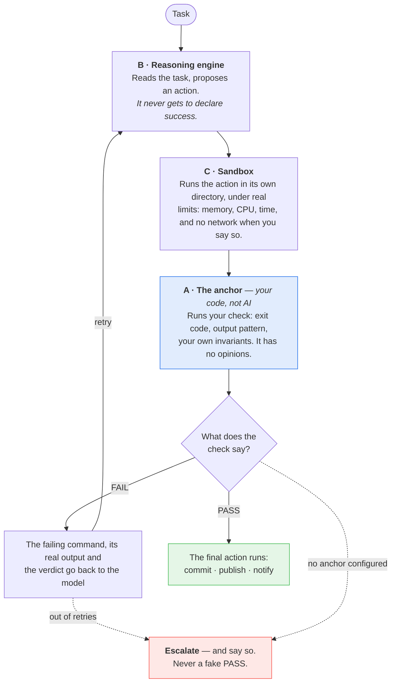
```mermaid
flowchart TD
    T([Task]) --> B["<b>B · Reasoning engine</b><br/>Reads the task, proposes an action.<br/><i>It never gets to declare success.</i>"]
    B --> C["<b>C · Sandbox</b><br/>Runs the action in its own directory, under real<br/>limits: memory, CPU, time, and no network when you say so."]
    C --> A["<b>A · The anchor</b> — <i>your code, not AI</i><br/>Runs your check: exit code, output pattern,<br/>your own invariants. It has no opinions."]
    A --> V{"What does the<br/>check say?"}
    V -- "FAIL" --> R["The failing command, its real output and<br/>the verdict go back to the model"]
    R -- "retry" --> B
    R -. "out of retries" .-> E["<b>Escalate</b> — and say so.<br/>Never a fake PASS."]
    V -- "PASS" --> F["The final action runs:<br/>commit · publish · notify"]
    V -. "no anchor configured" .-> E

    style A fill:#1f6feb22,stroke:#1f6feb
    style E fill:#f8514922,stroke:#f85149
    style F fill:#3fb95022,stroke:#3fb950
```

**The one rule that makes it work: the model can *propose* a `PASS`, but only
layer A can *declare* one.** With no real check behind it, nothing is ever declared
`PASS`: a batch run with `anchor.kind: none` refuses to start, and an interactive one
reports every result as unverified. There is no "trust me" mode — a `PASS` with nothing
behind it is the exact failure this architecture exists to prevent.

| Layer | What it is | Why it matters |
|---|---|---|
| **A · The anchor** | Deterministic code. By default it **reads the gate the project already declares** (`.motita/anchor`, a Makefile's `check`/`test`, `go test ./...`, a `package.json`'s `lint`/`typecheck`/`test`, `cargo test`, `pytest`); or it runs your own command and checks, exit code and output pattern. | It cannot be talked into a different answer. Fast, boring, predictable. |
| **B · The reasoning engine** | A hand-written client for the OpenAI chat and Responses APIs, Anthropic, Gemini, Copilot and Qwen, plus the official `claude` CLI for a Claude subscription. It counts the tokens each provider reports, per agent. | Point it at OpenAI, Codex, Claude, Gemini, Qwen, Copilot, Ollama (local or Cloud), Groq, OpenRouter, DeepSeek, or your own box. Nothing else in the agent knows which. |
| **C · The sandbox** | Runs the proposed action under real limits, with its HOME, temporary files and installed toolchains kept **outside** your repository. | And it **tells you what it could not apply** instead of pretending the isolation is stronger than it is. |

## Why that changes what you get

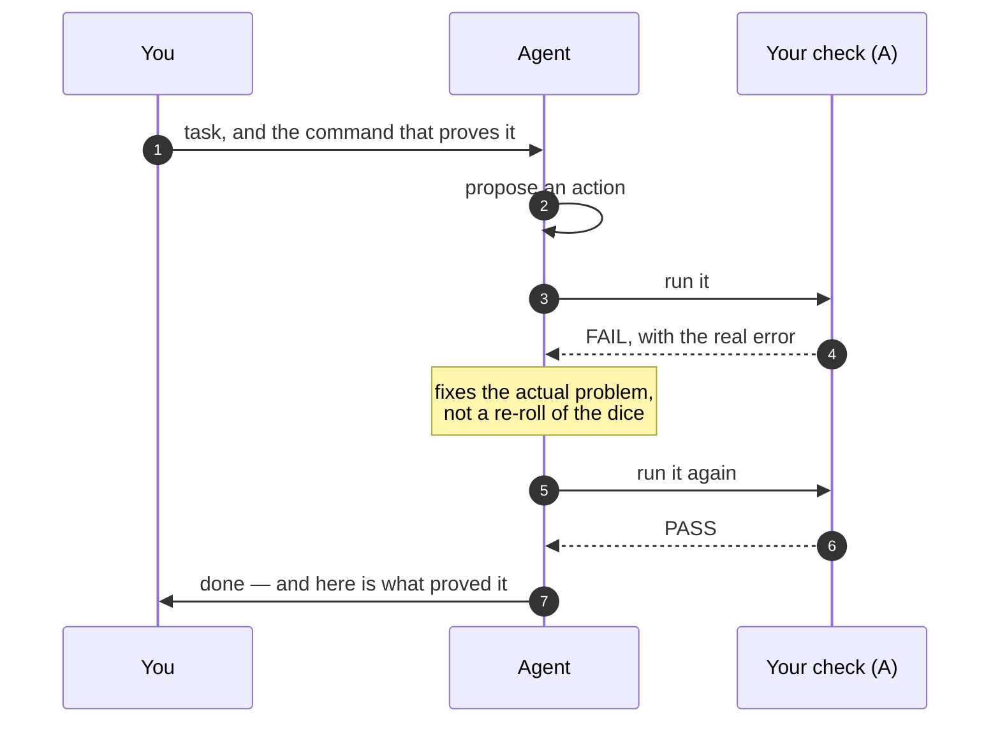
```mermaid
sequenceDiagram
    autonumber
    participant You
    participant Agent
    participant Check as Your check (A)
    You->>Agent: task, and the command that proves it
    Agent->>Agent: propose an action
    Agent->>Check: run it
    Check-->>Agent: FAIL, with the real error
    Note over Agent: fixes the actual problem,<br/>not a re-roll of the dice
    Agent->>Check: run it again
    Check-->>Agent: PASS
    Agent->>You: done — and here is what proved it
```

**Retries that learn something.** When a check fails, the agent gets the failing
command, its real output, and the structured verdict back.

**Nothing is "working" because it sounded like it.** The end-to-end test asserts
the result **on the filesystem**, not in what the agent says about itself. The
simulated model in that test gets it wrong on purpose on the first attempt and
corrects itself on the second, so the whole recovery loop is exercised for real
on every commit.

**Your exit code means something.** `0` when every task passed its check, `1` when
any failed, `2` for a bad configuration. Drop it in cron or systemd and it behaves
like a program, not like a chatbot.

## Long tasks, without wasted rounds

A check that decides is only half of it; the other half is getting there without
burning the round budget. A real session on this repository is the reason for most of
what follows: about 130 rounds over 35 minutes, 51 replies that could not be used, 22
rounds spent installing a toolchain, and a gate that could never pass because `make` was
not on its `PATH`. The same kind of task now finishes in about a minute.

- **Replies that can't come back malformed.** With the `claude-code` provider the next
  action is requested with a JSON schema the CLI enforces. With every other provider the
  reply is read tolerantly: every candidate is tried, stray control characters are
  repaired, and commands written as pseudo tool calls are still read as commands.
- **Files are written, not escaped.** `write_file` and `edit_file` (one exact
  search/replace block) change files without a heredoc or an inline script, confined to
  the workspace and refused in read-only mode.
- **Toolchains are installed once.** Commands run with `HOME` and `TMPDIR` under
  `sandbox.tools_dir` (`~/.motita-tools` by default), outside the repository; a toolchain
  unpacked into `tools/<name>/` is on `PATH` from the next command, in every later
  session, and for the anchor too. Long gates get `sandbox.check_timeout` (15 minutes)
  instead of the per-command limit.
- **A failing check is not waved through.** A claim of done while a check the run
  executed itself is still red is sent back, including one whose exit status was hidden
  behind `| tail`.
- **Old failures are named, not blamed.** When the project's own gate fails on a claim
  of done, the failing checks are run once on a clean checkout of the tree the run
  started from (`anchor.baseline`). A check that failed there too is reported as
  already failing; one that passed there is a breakage the run caused, and the rejection
  says so. A check you configured states the goal and is never excused this way.

## It runs where nothing else runs

motita is written in **pure Go: standard library only, zero external
dependencies, no cgo**. `go.mod` has no `require` line. There is no `go.sum`,
nothing to vendor, nothing to patch.

The result is a **single static binary** — copy it to a machine over `scp`, walk
away, and it works. No Go toolchain, no runtime, no container, no dependency tree
you'll regret in two years.

| | |
|---|---|
| **Linux** | `386`, `amd64`, `arm` (ARMv7), `arm64` |
| **Windows** | `386`, `amd64`, `arm64` |
| **macOS** | `amd64`, `arm64` |
| **Published size** | 17.8 – 18.9 MiB per binary (measured on all 9 binaries of the v0.10.0 release) |

`386` is a **first-class target**, not an afterthought nobody tests. The
end-to-end suite builds the agent and runs it inside a real 32-bit container, so
what gets verified is the artifact you download, not a rebuild of it.

## Install

```sh
curl -fsSL https://madkoding.github.io/motita/install.sh | sh
```

On Windows, in PowerShell:

```powershell
irm https://madkoding.github.io/motita/install.ps1 | iex
```

That is the same installer for Windows: it detects the architecture, downloads
the matching `.exe`, verifies it against the release's `SHA256SUMS`, and puts it
on your `PATH` without administrator rights. Everything below applies to both.

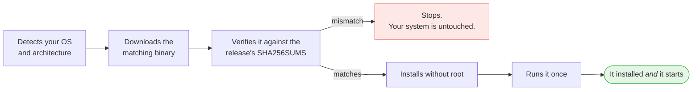
```mermaid
flowchart LR
    D["Detects your OS<br/>and architecture"] --> G["Downloads the<br/>matching binary"]
    G --> S["Verifies it against the<br/>release's SHA256SUMS"]
    S -- "mismatch" --> X["Stops.<br/>Your system is untouched."]
    S -- "matches" --> I["Installs without root"]
    I --> R["Runs it once"]
    R --> OK(["It installed <i>and</i> it starts"])

    style X fill:#f8514922,stroke:#f85149
    style OK fill:#3fb95022,stroke:#3fb950
```

That last step is the part most installers skip, and it's the one failure that
matters: a binary that installs but won't start.

Then:

```sh
motita
```

That's it. If no configuration exists, a short setup launches automatically —
no need to know about `-init`. It shows where you are (`[2/5]`), lets you move through
every list with `↑` `↓` (or type the number, or the answer itself), takes the highlighted value
when you press Enter, masks a key as you paste it, and writes nothing until you have seen the
result:

1. **Provider**: OpenAI, OpenAI Codex, GitHub Copilot, Ollama (local or Cloud), Anthropic
   (Claude), your Claude subscription through Claude Code, Google Gemini, or Qwen — each
   one listed with what it takes to connect (an API key, a login, nothing).
2. **Connect**: the endpoint where it can vary (any OpenAI-compatible host; Ollama on your
   machine or in the cloud), then the sign-in: **log in with your account** — open a link
   in your browser (and, for device logins, enter a one-time code) — or paste an API key.
   A login that fails is offered again instead of ending the setup.
3. **Model**: each provider ships curated defaults (the first one is marked
   *recommended*), Ollama lists what your server actually has, or type any model ID.
4. **Check**: what decides whether a task is really done. This is the question other
   tools never ask — and the default answer is **detect it from the project**, so one
   configuration works on every repository (`check`/`test` from a Makefile,
   `go test ./...`, a `package.json`'s `lint`/`typecheck`/`test`, `cargo test`). A
   project with an unusual build names its own gate in `.motita/anchor`, one command per
   line.
5. **Review and save**: every answer on one screen, the key masked. `n` goes through the
   questions again; Enter saves.

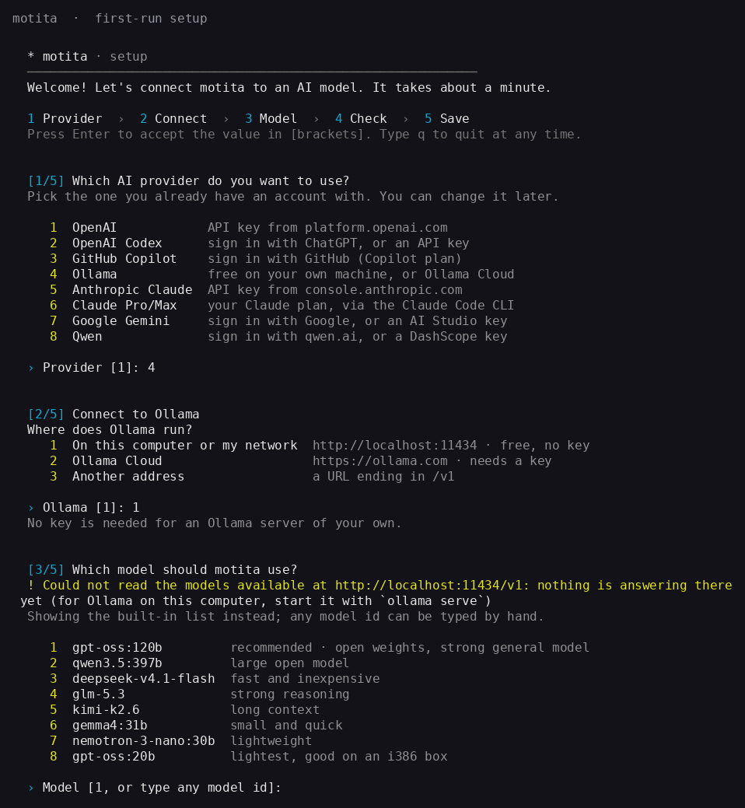

<sub>The first-run setup: each provider says what it needs, Ollama is asked where it runs, and
an unreachable server is explained instead of dumped as a dial error.</sub>

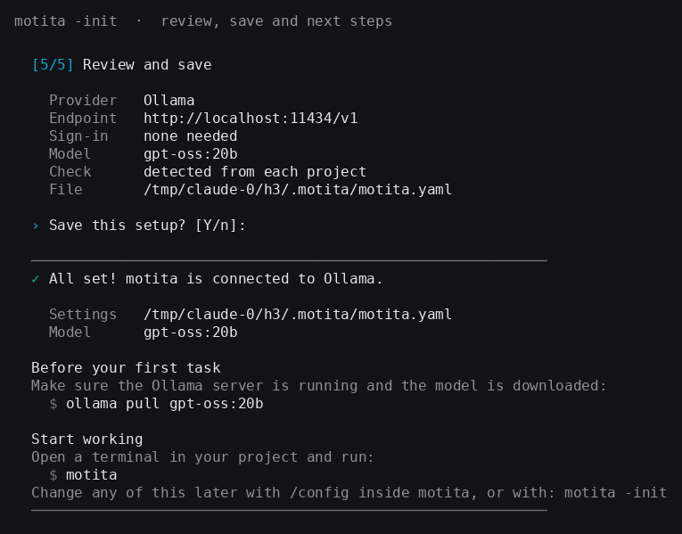

<sub>Nothing is written before the review. The summary says what to do before the first task.</sub>

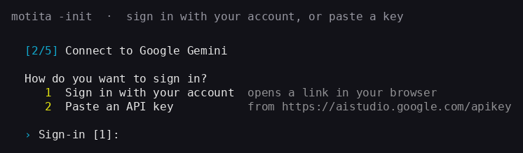

<sub>For Copilot, Codex, Gemini and Qwen: log in with your account, no API key needed.</sub>

Running the setup again — `/config` inside motita, or `motita -init` — is how you change
the provider, the key, the model or the check. It **offers to keep** the key and the login
you already have, keeps the previous configuration as `motita.yaml.bak`, and the new setup
**takes effect immediately** in the session you ran it from.

### Providers and how each one authenticates

| Provider (`llm.provider`) | API key (variable) | Account login | Protocol |
|---|---|---|---|
| `openai` | `OPENAI_API_KEY` / `MOTITA_LLM_API_KEY` | — | `/chat/completions` (any OpenAI-compatible host) |
| `codex` | `OPENAI_API_KEY` / `MOTITA_LLM_API_KEY` | **Sign in with ChatGPT** (PKCE; Plus/Pro/Business plans) | `/responses` |
| `copilot` | `GITHUB_COPILOT_TOKEN` (a GitHub OAuth token) | **GitHub device code** (active Copilot subscription) | `/chat/completions`, session token renewed every ~30 min |
| `ollama` | `OLLAMA_API_KEY` (Ollama Cloud only) | — (a local server needs nothing) | `/chat/completions` |
| `anthropic` | `ANTHROPIC_API_KEY` | — (see `claude-code`) | `/v1/messages` |
| `claude-code` | — | `claude auth login` (Anthropic's own CLI holds it) | the `claude` CLI |
| `gemini` | `GEMINI_API_KEY` | **Google login** with your own OAuth client, or gcloud's ADC | `generateContent` |
| `qwen` | `DASHSCOPE_API_KEY` | **qwen.ai device code** (Qwen Code account) | `/chat/completions` |

Logins live in `~/.motita/auth/<provider>.json` (`0600`, override the directory with
`MOTITA_AUTH_DIR`) together with their refresh token; motita renews the access token
before it expires and once more if the server refuses it. An API key always wins over a
stored login. A key you paste goes into a separate `0600` file beside the configuration
(`~/.motita/motita.env`), never into the config, so the config can be committed and shared.
motita reads that file on its own — nothing has to be sourced — and a variable exported in
your shell still wins over it.

- **Claude subscriptions** are reached only through the `claude-code` provider: Anthropic
  allows Pro/Max plans in its own Claude Code client, so motita drives that client instead
  of borrowing its OAuth identity.
- **Gemini login** needs an OAuth client you own: either run
  `gcloud auth application-default login --client-id-file=client_secret.json --scopes='https://www.googleapis.com/auth/cloud-platform,https://www.googleapis.com/auth/generative-language.retriever'`
  (the wizard copies those credentials), or export `MOTITA_GEMINI_CLIENT_ID` and
  `MOTITA_GEMINI_CLIENT_SECRET` for a *Desktop app* client. The calls are billed to the
  Google Cloud project you name.
- **Codex login** receives the browser on `http://localhost:1455`. On a machine the browser
  cannot reach (SSH), paste the URL the browser ends on into the wizard.
- **Ollama**: the wizard asks whether it runs locally (`http://localhost:11434/v1`, no key)
  or on Ollama Cloud.

### Your Claude subscription, through Claude Code

The `claude-code` provider runs motita on your Claude Pro or Max plan by starting the
official `claude` CLI as its model. You need [Claude Code](https://code.claude.com/docs/en/setup)
installed and logged in once with `claude auth login`. motita never reads or stores those
credentials, and it clears `ANTHROPIC_API_KEY` and the other backend overrides from claude's
environment so your subscription login is the one that gets used. motita still runs its own
loop, tools and sandbox: claude only answers with text and tool calls.

```yaml
llm:
  provider: claude-code
  model: sonnet        # or opus, haiku, fable, or a full model id
```

`/models` lists the models your account offers, as claude's own picker does, and
`/models <id>` switches to one. `llm.reasoning` becomes claude's `--effort` (off switches
thinking off), and `llm.max_tokens` caps each answer. claude runs in motita's working
directory, which it reports to the model (it loads no `CLAUDE.md` or settings from it), and
the directory stays the same across turns, so every turn can reuse the prompt cache. Set
`MOTITA_CLAUDE_BIN` if `claude` is not on your `PATH`.

## A terminal interface you'll actually want to use

Run it with no arguments and you get a full TUI. Written against the standard library
alone — it's the same binary, not a wrapper around something else.

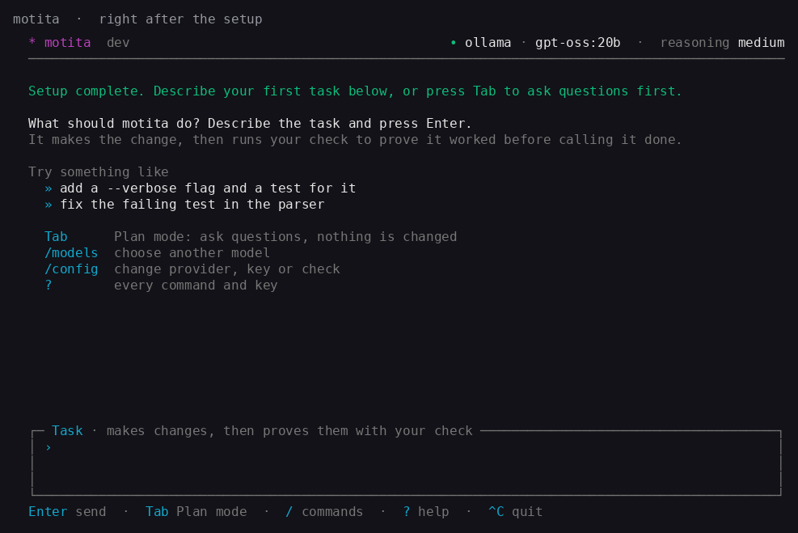

- **One line says who is answering**: the provider and model, how hard it thinks, and —
  in words, not just a red dot — when there is no API key and how to add one.
- **The input box says what Enter will do**: its title is the mode. **Task** makes changes
  and proves them with your check; **Plan** (press `Tab`) only reads and explains.
- **The footer shows the keys that work right now** — while you type a command, while a
  task runs, while you scroll back — instead of a manual.
- **You stay in control while it works**: `Esc` stops the running task (on the gateway
  too), the conversation scrolls, and a message typed meanwhile is queued and sent when
  the task finishes.
- **`/` opens the command list** (`↑↓` to choose, `→` to complete, `Enter` to run), and
  `?` shows every command and key. A plain word is always a message: typing `new` or
  `good` never runs a command by accident.
- **In English or in Spanish**: the terminal, the browser and the setup follow your
  system's language, or the one you choose (`ui.language`, see [the reference](docs/REFERENCE.md#the-interface-language)). `/language es` switches
  at once, and the choice is saved for every interface.
- **A failed turn says what to do**: the error as it happened, plus a hint for the
  failures newcomers meet first — a local Ollama that is not running, a key the provider
  refused, a model that does not exist, a rate limit.

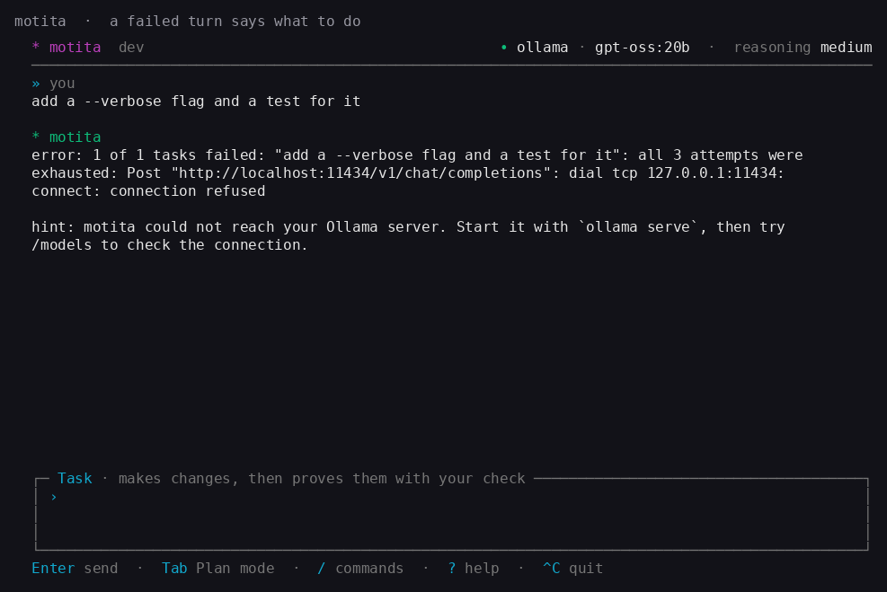

**The same process is also a gateway.** It listens on **every interface** and enforces
**no origin rules** — the same posture as a machine with a fresh, empty firewall table:
everything is accepted until you add a rule. The terminal you are looking at is one of
its **clients**, so a web page or a phone can join the same conversation, with the same
procedure library and the same reward ledger. Narrow it by adding rules to
`gateway.allow`:

```yaml
gateway:
  allow: ["lan"]            # only the local network; everything else still gets in
  allow: ["lan", "!any"]    # the local network ONLY — usually what you want
  allow: ["!any"]           # this machine only
  allow: ["10.0.0.5"]       # one machine, everything else still gets in
  allow: ["!192.168.1.0/24"] # everything except one network
```

Rules are an ordered list, the first one that matches decides, and loopback is always
allowed — so a rule set can never lock you out of the machine you configured it on. The
token is what stands between the network and an agent that runs commands here; the rules
say where that token may come from. The supported way to reach a remote gateway without
exposing it at all is still a tunnel: `ssh -N -L 7477:127.0.0.1:7477 the-host`. There is
**no TLS** in this version, and the gateway says so at open time.

**The two halves come apart.** `-serve` runs the gateway and no interface; `-connect` runs the
interface and no gateway:

```bash
# on the machine that runs the commands
motita -serve -gateway 127.0.0.1:7477

# anywhere else — no sandbox, no reasoning engine, no agent in this process
motita -connect 127.0.0.1:7477 -tui
motita -connect 127.0.0.1:7477 -session s7f3a1c9e -tui
motita -connect 127.0.0.1:7477 -p "how many files are there?"
```

A process in `-connect` mode builds **no sandbox, no procedure library and no reasoning
engine** — all three belong to the machine running the gateway. That is what lets it run
where the agent could never run: a laptop, a phone, a tablet — through the tunnel
above.

Inside the interface, `/sessions` lists the conversations the gateway holds — marking the
one you are on and naming any with a run in flight — and `/attach <id>` moves to another
one. The token is **read** from `gateway.token`, never minted, and a `-session` the
gateway does not hold is refused at start with the list of the ones it does.

### The browser interface, from the same port

The gateway serves a web interface **from its own port** — no second server, no second
address, and no CORS, because the page and the API share an origin. It comes up with the
gateway (`gateway.webui: false` turns it off):

```
$ motita gateway start
the gateway is running at http://127.0.0.1:7477 (pid 4211, v0.5.0-72-gcadb33f)

this gateway is listening on every interface (port 7477): any machine that can
reach this host may connect, subject to the rules below.
no origin rules are set, so EVERY origin is accepted (gateway.allow is empty).
add a rule to gateway.allow to narrow it: "lan", an address, a network, or
"!any" for this machine only.
there is no TLS, so the token travels in clear text to every one of them.

the interface is at http://127.0.0.1:7477/#t=<token>
open that link once: the page trades the fragment for a cookie and drops it

from another machine, use whichever of these reaches this host - same port,
same fragment, and the link above only works on this machine:
  http://192.168.1.20:7477/#t=<token>
```

Notice the two answers: **where the socket is open** and **who may use it**. The link is a
loopback address because a wildcard bind has to be normalised into something a client can
actually dial — which is exactly why the exposure is reported separately rather than read
out of the link.

The second list exists for the same reason. The address a *remote* browser needs cannot be
derived from the listener, and asking the operator to substitute their own address is a
networking question asked at the moment they are least equipped to answer it — the symptom
being a page that reports `not connected` with nothing to explain why. So the addresses this
host actually answers on are printed instead, IPv4 first, with the container-only bridges
left out because nothing outside the machine can reach them.

The token rides in the URL **fragment**, which a browser never sends to the server, and
the page immediately trades it for an `HttpOnly`, `SameSite=Strict` cookie whose value is
an **HMAC of the token** rather than the token itself. So a cookie lifted from a browser
is not a reusable credential, nothing is stored server-side, and **rotating the token
invalidates every cookie** with nothing to clean up. The page is served without a token —
like a login form — and therefore holds no secret at all.

The token is **not a setting to configure**. Nothing in the YAML mints it and nothing needs
to: the gateway generates one the first time it starts, keeps it in `gateway.token_file`
(mode 0600) and prints it inside the link. So opening the plain address — the IP with no
`#t=…` — lands on a page that reports `not connected`, and the honest reading of that is
"open the link, not the address", never "go and configure a token". The page says exactly
that, because the first reading sends people hunting for a key that was never meant to exist.

The page paints the conversation the gateway already has, streams a turn live, resumes
from the last event it saw when the connection drops, and shows an approval with the
command **whole** (or, once you choose "allow all commands" for a session, says which
command ran on that standing answer). Around the conversation:

- **Answers rendered as Markdown**, and a conversation that does not move under you
  while you read.
- **A thinking drawer** with the model's reasoning as it streams, and **a terminal
  drawer** with every command and its output.
- **An agents drawer** with the run's background agents: purpose, state, elapsed time,
  tokens (input, output, cache) and, once one finishes, its summary and the command that
  merges its branch.
- **The steps of a turn collapse into a counter** ("12 actions") that opens on click;
  `gateway.show_actions: true` lists them instead.
- **A language selector** in the sidebar: Automatic (the browser's), English or Español.
  It is saved in the configuration, so the terminal changes with it.
- **A report you can check** at the end of a task: what changed, how it was verified,
  the risks, and the screenshots the agent saved under `.motita/previews/`, first.
- **Projects and sessions** in the sidebar, checkpoints to go back, the skill library
  and the schedules, and failures reported in a toast instead of a silent nothing.
- It installs as an app (PWA).

It is compiled into the binary: the shell every visit downloads is **596 KiB**, against a
**1,120 KiB** budget, with the heavy parts (syntax highlighting, formulas, diagrams, the
emoji set) loaded only when a message needs them. A test fails if the assets outgrow it.

### More than one conversation at a time

A gateway holds **several conversations at once**, each with its own run slot, its
own transcript, and its own approval prompt. Two clients working at the same time
do not wait for each other, and a second run in the *same* conversation is refused
with a `409` instead of being queued: one conversation has one slot, and saying so
is more useful than pretending otherwise.

Every conversation endpoint names the conversation it is about — the default one
included, because there is no second way in:

```sh
curl -H "Authorization: Bearer $TOKEN" http://127.0.0.1:7477/v1/sessions
# {"sessions":[{"id":"default","created":"...","last_used":"...","running":false}]}

curl -X POST -H "Authorization: Bearer $TOKEN" http://127.0.0.1:7477/v1/sessions
# {"id":"s7f3a1c9e"} — now drive /v1/sessions/s7f3a1c9e/task

curl -H "Authorization: Bearer $TOKEN" http://127.0.0.1:7477/v1/sessions/default/config
curl -X DELETE -H "Authorization: Bearer $TOKEN" \
  http://127.0.0.1:7477/v1/sessions/s7f3a1c9e
```

| Endpoint | What it does |
|---|---|
| `GET /v1/health` | the only one that needs no token: liveness |
| `GET` `POST /v1/projects` · `DELETE /v1/projects/{id}` | the repositories motita works on; adding one runs `git init` when it is not a repository yet |
| `GET /v1/projects/{id}/deletion-preview` | what deleting a project would discard, before you confirm with `?force=1` |
| `GET` `POST /v1/sessions` | list what is held, or open one more (in a project: its own worktree and branch) |
| `GET` `PATCH` `DELETE /v1/sessions/{id}` | that conversation's figures (`running`, `agents_running`, branch, changes), rename it, or close it and give its worktree back |
| `GET /v1/sessions/{id}/deletion-preview` | the uncommitted work a deletion would lose; `DELETE …?force=1` confirms |
| `POST /v1/sessions/{id}/task` `/plan` | run a task (or a read-only one), streamed as server-sent events |
| `GET /v1/sessions/{id}/events?from=<seq>` `/run` | re-attach to the run in flight from the last event seen, or ask whether there is one |
| `POST /v1/sessions/{id}/cancel` | stop the run |
| `POST /v1/sessions/{id}/runs/approval` `/auto-approve` | answer a pending confirmation, or allow every command for this session |
| `GET /v1/sessions/{id}/agents` | the run's agents: purpose, state, elapsed time, tokens, branch |
| `GET /v1/sessions/{id}/checkpoints` · `POST …/checkpoints/{turn}/restore` | the turns you can go back to; the conversation always rewinds, the files only with `{"files":true}` |
| `POST /v1/sessions/{id}/merge` `/continue` | the agent integrates the session's branch (the session becomes read-only), or a fresh session starts from the updated base |
| `GET /v1/sessions/{id}/messages` `/report` | the transcript, and the conversation so far |
| `GET /v1/sessions/{id}/config` `/models` `/model-list` `/providers` `/reward` `/questions` `/skills` | the read-only views |
| `PATCH /v1/sessions/{id}/config` · `POST …/reasoning` `/verdict` `/reset` | change the provider or the model, the thinking budget, grade a turn, start over |
| `POST /v1/sessions/{id}/config/reload` | apply the configuration file as it is now (what `/config` calls after the setup) |
| `GET /v1/sessions/{id}/ws` | **WebSocket**: bidirectional, flag-based message protocol (see below) |
| `GET` `POST /v1/schedules` · `PATCH` `DELETE /v1/schedules/{id}` · `POST …/run` | tasks that fire on their own: list, add, pause, retarget, remove, run now |
| `GET` `POST /v1/skills` · `GET` `DELETE /v1/skills/{name}` · `GET /v1/skills/archived` | the procedure library: index, write, read, delete (a shipped one is refused with `409`), the archive |
| `POST /v1/skills/{name}/pin` `/restore` `/disable` | exempt one from curation, bring it back, or turn it off |
| `GET /v1/curator` `POST /v1/curator/run` | the maintenance pass: report it, or run one |
| `GET /v1/update/check` `POST /v1/update/run` | is there a newer release, and install it (verified against `SHA256SUMS`) |
| `GET /v1/commands` | the slash commands, for a client that offers them |
| `GET` `PUT /v1/ui` | the interface language: auto, en or es, saved in the configuration |

The default conversation belongs to the process that started the gateway: closing it
is refused, because that process would be left talking to a conversation that no
longer exists. `gateway.max_sessions` caps how many a process holds IN MEMORY (`0`
means the built-in default, 64); the ceiling bounds how many transcripts are
resident — conversations beyond it stay on disk and are re-materialised on demand.

**Tasks that fire on their own** live in `~/.motita/schedules/`, one JSON file each, and are
driven through `/v1/schedules`. The cadence is a duration (`30m`, `24h`), not a cron
expression, and a task fires **into a conversation that already exists** — so a scheduled turn
appears in that session's transcript and is attachable like any other. A scheduled run has
nobody to ask, so a command the policy wants to confirm is **refused** and the record says why;
the documented escape hatch for unattended work is `agent.policy.enforce=false`.

**The port is 7477 by default**, chosen because IANA leaves it unassigned, nothing
well known uses it, and it sits below the ephemeral range a Linux box hands out by
default. Some hosts widen that range (this one goes down to 1024), in which case a
fixed port can occasionally collide with an outgoing connection — if a start fails
with `address already in use`, pick another with `-gateway 127.0.0.1:<port>`.

### Projects, sessions, and going back

Point motita at a repository and it becomes a **project**. Every session in a project
works in **its own git worktree on its own branch** (`motita/<session>`), with the
project's dependency folders (`node_modules`, `.venv`, `vendor`, …) linked rather than
reinstalled. Two sessions never step on each other's files, and your own checkout is
never touched while they work.

- **Every turn is a checkpoint.** Go back to any of them: the conversation always
  rewinds, and the files too when you ask, after the current state is saved where it can
  be recovered.
- **The agent integrates its own work.** Ask for it (the button in the browser, or
  `POST …/merge`) and the agent commits what is left and merges the branch into the
  project's; the session then becomes read-only, and *continue* opens a fresh session
  from the updated base.
- **Deleting asks first.** A session or project with uncommitted work shows exactly
  which files would be lost, and nothing is discarded until you confirm.
- **Procedures can belong to a project.** `<project>/.motita/skills/` is searched first
  and shadows the shared library.

### Background agents, side by side

A task with independent pieces doesn't have to be done one piece at a time. The agent
can start **background agents** (`spawn_agent`) and collect them later (`wait_agents`):

- Each one starts from a snapshot of the current tree (uncommitted work included) and
  works in **its own worktree, on its own branch** (`motita/sub/…`). When it finishes,
  its report says what it did, how many files changed, and the command that merges it.
- At most `agent.max_parallel` run at once (3 by default; `0` turns the feature off). A
  claim of done while one is still running is sent back once; a second one cancels it.
- A background agent is held to **the project's own gate**, not to a check that states
  the whole task's goal, which one piece of it could never pass; the main agent's check
  judges the merged result.
- Nobody is watching a background agent, so it **never opens a question**: in a session
  where you allowed every command it runs what the main agent could, and otherwise a
  command that needs approval is refused with a reason.
- **You see all of it**: purpose, state, elapsed time, round, current activity and the
  tokens each one has spent, in the terminal (`Ctrl+G` or `/agents`, and a
  `≡ 2 running · 48.2k tok` segment in the footer) and in the browser's agents drawer.

Outside a repository there is nothing to branch, so a background agent runs read-only
and is good for research and review.

### WebSocket: a bidirectional flag protocol

The SSE stream (`POST /task`, `GET /events`) is the existing way to follow a run. The
gateway also speaks **WebSocket** at `GET /v1/sessions/{id}/ws` — a persistent,
bidirectional connection for a client that wants a structured protocol with flags,
heartbeat, and push, rather than a one-shot HTTP request. It shares the same
conversation, the same token, and the same run slot as the HTTP API: a second transport,
not a second agent.

The WebSocket implementation is **standard library only** — the RFC 6455 handshake and
frame layer are hand-written (~200 lines), because a WebSocket library costs +150-200 KB
against a binary whose ceiling is a runaway-growth guard, not a per-feature budget.

**Every message — inbound and outbound — is a JSON envelope:**

```json
{
  "msg_id": "550e8400-e29b-41d4-a716-446655440000",
  "type": "query",
  "flags": ["PROCESSING"],
  "timestamp": "2026-09-25T12:00:00.000Z",
  "payload": {}
}
```

| Field | Type | Description |
|---|---|---|
| `msg_id` | string | UUID v4 — unique per message |
| `type` | string | Message type (see table below) |
| `flags` | string[] | State/condition indicators (see table below) |
| `timestamp` | string | ISO-8601 |
| `payload` | object | Type-specific data |

**Message types:**

| Type | Direction | Description |
|---|---|---|
| `auth` | Client → Server | Initial authentication |
| `auth_response` | Server → Client | Authentication result |
| `query` | Client → Server | A query or request |
| `query_response` | Server → Client | Answer to a query (ack, partial, or completed) |
| `heartbeat` | Bidirectional | Keep-alive probe |
| `heartbeat_ack` | Bidirectional | Keep-alive confirmation |
| `notification` | Server → Client | Push notification |
| `error` | Server → Client | Error message |

**Flags:**

| Flag | Meaning |
|---|---|
| `AUTHENTICATED` | The client is authenticated |
| `UNAUTHORIZED` | Authentication failed |
| `IDLE` | The agent is idle / waiting |
| `BUSY` | The agent is processing a task |
| `PROCESSING` | The query is being processed |
| `COMPLETED` | The task / query finished successfully |
| `PARTIAL` | The response is partial (streaming) |
| `ERROR_RECOVERABLE` | An error the connection can recover from |
| `FATAL_ERROR` | A critical error; the connection will close |
| `LOW_MEMORY` | The agent is low on memory |
| `RATE_LIMITED` | The client exceeded the rate limit |
| `CACHE_HIT` | The response came from cache |
| `CACHE_MISS` | The response was generated in real time |
| `ENCRYPTED` | The payload is encrypted |

**Connection flow:**

```
1. Client connects to /v1/sessions/{id}/ws (bearer token in the upgrade request)
2. Server sends a welcome:  { type: "auth_response", flags: ["IDLE"] }
3. Client sends auth:       { type: "auth", payload: { "token": "..." } }
4. Server responds:         { type: "auth_response", flags: ["AUTHENTICATED","IDLE"] }
   — or on failure:         { type: "auth_response", flags: ["UNAUTHORIZED"] }
5. Client sends a query:    { type: "query", payload: { "query": "..." } }
6. Server acks immediately:  { type: "query_response", flags: ["PROCESSING"] }
   — progress lines stream:  { type: "query_response", flags: ["PARTIAL","PROCESSING"] }
   — on completion:          { type: "query_response", flags: ["COMPLETED"], payload: { "result": "..." } }
   — on error:               { type: "error", flags: ["ERROR_RECOVERABLE"], payload: { "error": "..." } }
7. Server sends heartbeat every 30s; client must respond with heartbeat_ack in 10s
   — no ack → the connection is closed
8. Malformed JSON → error with ERROR_RECOVERABLE
   Unknown type → error with ERROR_RECOVERABLE
   Query before auth → error with UNAUTHORIZED
```

Multiple clients may connect simultaneously — each runs in its own goroutine and is
independent. The conversation's one-run-at-a-time guard still applies: a second client
that tries to start a run while one is in flight gets a `query_response` with `BUSY`.

It is a **fixed** port rather than an ephemeral one because the gateway can now be a
service that outlives the process that started it, and a later process has to be able to
find it. An ephemeral port is chosen at bind time: it exists in the memory of one process
and nowhere else.

That is also why `motita gateway start` exists:

```sh
motita gateway start    # the gateway as a service, in the background
motita gateway status   # is one running, and where?
motita gateway stop     # stop the one the service file names
```

And why plain `motita` now **attaches** instead of always starting its own:

| Situation | What you get |
|---|---|
| a gateway is already running | the interface connects to it and shuts nothing down — a service you started on purpose is not killed because a terminal connected |
| nothing is running | one is brought up for this interface, in-process, and goes away with it |
| `-gateway off` | no gateway: the direct path, as before |

The interface's gateway is in-process on purpose, which is the opposite of what
`gateway start` does: the service exists to outlive its shell, while this one exists *for*
the interface and must die with it however the process dies. A re-executed child would
survive a `SIGKILL` and leak. Two terminals against one service are not two agents on two
ports — they are **two views of one conversation**.

| Command | What it does |
|---|---|
| `/task` `/plan` | switch between doing work and read-only exploration |
| `/models` `/models <id>` | your provider, your key status and the models it really publishes; with an id, switch to that model for this session |
| `/reasoning` | cycle the thinking budget |
| `/good` `/bad` | tell the agent how a turn went |
| `/value` | see what it has learned from those verdicts |
| `/agents` or `Ctrl+G` | open or close the panel of the run's agents: purpose, state, elapsed time, round, tokens, activity |
| `/sessions` `/attach <id>` | the conversations the gateway holds, and move to another one |
| `/config` | run the setup again; the new configuration applies to the session you are in |
| `/language [en\|es\|auto]` | show or change the language of the interfaces; it is saved in the configuration |
| `/update` | install the newest release (the welcome screen says when there is one; the download must match the release's `SHA256SUMS`, or nothing is installed); a `-serve` gateway restarts itself on the new binary, an interface tells you to restart it |
| `/session` `/find` `/new` `/help` `/quit` | context, search, fresh start, help, leave |

The steps a turn runs show as one line that counts them ("7 actions");
`gateway.show_actions: true` lists every one instead.

**Plan mode is structurally read-only**, and that word is doing real work:

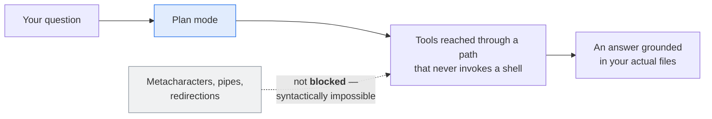
```mermaid
flowchart LR
    Q["Your question"] --> P["Plan mode"]
    P --> TL["Tools reached through a path<br/>that never invokes a shell"]
    TL --> ANS["An answer grounded<br/>in your actual files"]

    M["Metacharacters, pipes,<br/>redirections"] -.->|"not <b>blocked</b> —<br/>syntactically impossible"| TL

    style P fill:#1f6feb22,stroke:#1f6feb
    style M fill:#8b949e22,stroke:#8b949e
```

Pipes and shell metacharacters aren't filtered out in plan mode: there is nothing
to filter *and* nothing to bypass, because the shell is never in the path.

## It learns from you, not from a retraining pipeline

motita keeps a **library of procedures**: documents describing how a kind of
work is done — the steps, the commands that work, the pitfalls someone already
paid for. The model looks one up when it needs it, and **writes a new one when it
learns something**. They're files, so you can read them, fix them, and version
them. The built-ins ship inside the binary, so a fresh install starts with a
library instead of an empty shelf.

Eight procedures ship with it: running commands, files and directories, git in a
repository, calling an HTTP API, searching the web, installing a toolchain, verifying a
change, and diagrams and reports.

The shelf is not only about tools. Two of the documents that ship are about the
**shape of the answer**: one for showing the work — a diagram of the flow, a
`gitGraph` of the branches, the files a commit touched, a before/after that can be
read at a glance — and one for **verifying** a change rather than announcing it,
because a command that exited `0` is a statement about the program running and not
about the effect existing. Both apply to nearly every task, so the model searches
for them the way it searches for the rest of the shelf.

Then `/good` and `/bad` land on the procedures that turn actually used, and the
library is searched by what has worked out before. No fine-tuning, no API, no
extra bill. Just a ledger next to a shelf.

### You can see the shelf, and the shelf keeps itself tidy

A library you cannot look at is a library you have to trust. `motita` serves it:
the browser interface has a **Skill library** window — every document with what it
is for and how often it has been used, a filter, the document itself rendered, and
the archive behind it with a way back — and a switch on every row to turn one **off**
without losing it. `GET /v1/skills` is the same thing for
anything else you want to build on top.

Left alone, a shelf rots: procedures that stopped being true stay listed as if they
still were. So a **curator** runs on its own — a week apart, and only when nobody
has been talking for two hours, because a maintenance pass that fights your
conversation for the process is a maintenance pass you will turn off. It touches
**only the documents the agent wrote**: one you wrote by hand is yours, and the
curator never ages it. And it uses **no model** for the work that matters:

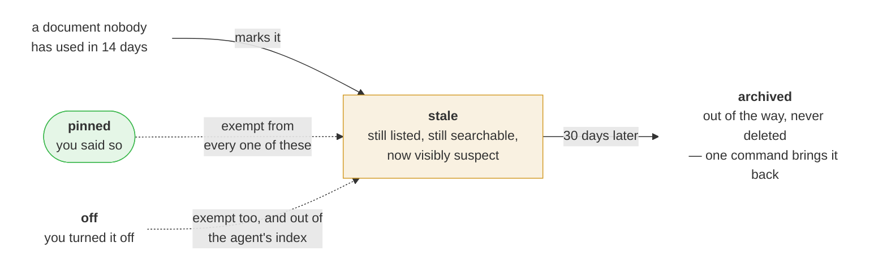
```mermaid
flowchart LR
    A["a document nobody<br/>has used in 14 days"] -->|"marks it"| S["<b>stale</b><br/>still listed, still searchable,<br/>now visibly suspect"]
    S -->|"30 days later"| R["<b>archived</b><br/>out of the way, never deleted<br/>— one command brings it back"]
    P(["<b>pinned</b><br/>you said so"]) -.->|"exempt from<br/>every one of these"| S
    O(["<b>off</b><br/>you turned it off"]) -.->|"exempt too, and out of<br/>the agent's index"| S

    style A fill:#ffffff08,stroke:#ffffff22
    style S fill:#d2992222,stroke:#d29922
    style R fill:#ffffff08,stroke:#ffffff22
    style P fill:#3fb95022,stroke:#3fb950
    style O fill:#ffffff08,stroke:#ffffff22
```

**No automatic transition ever deletes**, and **pinning is the veto**: a document you
pinned is skipped by every automatic transition, forever. That is the whole point of
the feature — it is your library, and the machine's job is to keep it in order without
ever being able to quietly throw away the part you care about.

You are the one who can, in the one place that asks first: **Turn off** takes a
document out of the agent's index and its search while leaving it in the list, badged
`off` and one click from coming back, and **Delete** is the only operation that keeps
nothing at all — the document and its usage history both go. A procedure that ships
inside the binary is refused, because reporting success for a deletion that did not
happen is worse than the refusal.

From the terminal it is one command away:

```bash
motita curator status   # the thresholds, the last pass, how many of each
motita curator run      # a pass right now; --dry-run shows the plan first
motita curator pin build-firmware
```

None of those need an API key. Tidying a shelf is filesystem work, and requiring a
model to sort files would be requiring a model to do something that does not use
one.

## Guardrails that can't be switched off

There are two layers, and only one of them is yours.

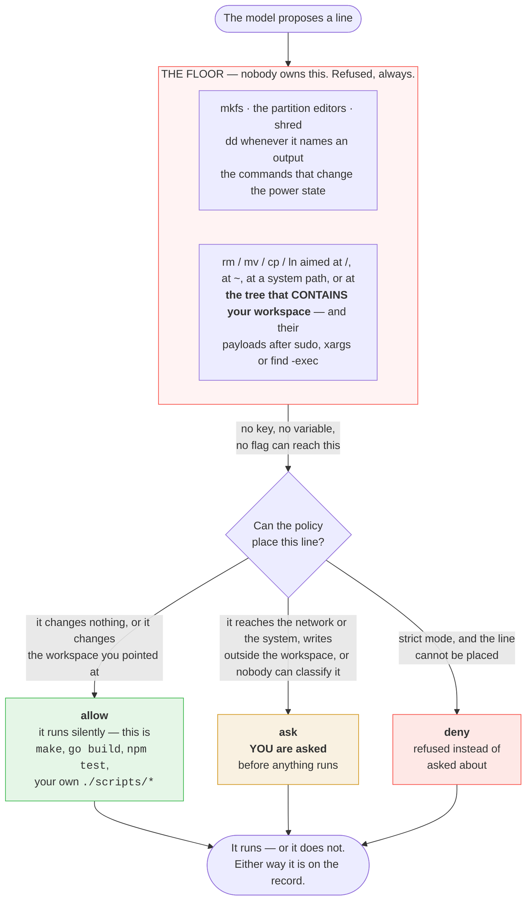
```mermaid
flowchart TD
    L(["The model proposes a line"]) --> FL

    subgraph FL ["THE FLOOR — nobody owns this. Refused, always."]
        direction LR
        F1["mkfs · the partition editors · shred<br/>dd whenever it names an output<br/>the commands that change the power state"]
        F2["rm / mv / cp / ln aimed at /, at ~, at a system path, or at<br/><b>the tree that CONTAINS your workspace</b> — and their<br/>payloads after sudo, xargs or find -exec"]
    end

    FL -->|"no key, no variable,<br/>no flag can reach this"| K{"Can the policy<br/>place this line?"}

    K -->|"it changes nothing, or it changes<br/>the workspace you pointed at"| AL["<b>allow</b><br/>it runs silently — this is<br/><code>make</code>, <code>go build</code>, <code>npm test</code>,<br/>your own <code>./scripts/*</code>"]
    K -->|"it reaches the network or the system, writes<br/>outside the workspace, or nobody can classify it"| AS["<b>ask</b><br/><b>YOU are asked</b><br/>before anything runs"]
    K -->|"strict mode, and the line<br/>cannot be placed"| DN["<b>deny</b><br/>refused instead of<br/>asked about"]

    AL --> RUN(["It runs — or it does not.<br/>Either way it is on the record."])
    AS --> RUN
    DN --> RUN

    style FL fill:#f8514911,stroke:#f85149
    style AL fill:#3fb95022,stroke:#3fb950
    style AS fill:#d2992222,stroke:#d29922
    style DN fill:#f8514922,stroke:#f85149
```

The subtle middle row is the whole design. `make`, `go build`, `npm test`,
`python3 build.py` and your own `./scripts/*` are recognised as the project's own
work and run **without a question** — because a policy that asks about those gets
switched off in a week, and then it protects nothing. What gets asked about is
what nobody can predict: an infrastructure tool, a binary nobody knows, an
interpreter handed code inline, or a script from outside the workspace.

There is one asymmetry in that row worth knowing before you meet it:
`./scripts/deploy.sh` runs silently, but `sh scripts/deploy.sh` is asked about.
Handing the same file to a shell hides it from the classifier — `sh -c 'ls'` and
`sh -c 'rm -rf /'` have the same shape — so the cautious answer is to ask. Name
the program directly and the policy can see it is yours.

There is no YAML key, no environment variable and no flag that relaxes the floor.
**That's the point.** A guardrail an operator can switch off is a guardrail that
*will* be switched off — during the incident it was meant for, by whoever wants
the task to finish.

And it isn't a claim on a slide: a test in the repository asserts the sentences
above against the classifier's real verdicts, so this page cannot drift away from
the behaviour.

## Why you can believe the numbers

This is tested the way you'd test something you were about to bet on.

| | |
|---|---|
| **Statement coverage** | **100% in every package that ships** — 32 of 33 (`./internal/... ./cmd/...`), checked package by package so a gap can't hide behind an average. `internal/review` is the one package without tests, and `tools/` holds the CI harnesses and is counted separately |
| **Test functions** | 3,735 across 291 files |
| **Code vs tests** | 47,237 lines of Go · 96,959 lines of test |
| **External dependencies** | 0 |
| **Platforms CI builds** | 9 — every one gets `-version` run in its own container on Linux, and a PE/Mach-O header + size check on Windows and macOS |

That coverage number isn't a badge. It's the mechanism that found the bugs
documented in the reference: the `RLIMIT_CPU` that never fired, the process group
that kept a 1-second deadline waiting for five, the sandbox directory that got
deleted before the validator could look inside it. Every one of them is a test
now.

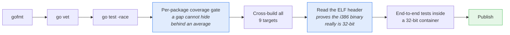
```mermaid
flowchart LR
    F["gofmt"] --> V["go vet"] --> R["go test -race"]
    R --> CV["Per-package coverage gate<br/><i>a gap cannot hide<br/>behind an average</i>"]
    CV --> X["Cross-build all<br/>9 targets"]
    X --> E["Read the ELF header<br/><i>proves the i386 binary<br/>really is 32-bit</i>"]
    E --> E2["End-to-end tests inside<br/>a 32-bit container"]
    E2 --> P["Publish"]

    style CV fill:#1f6feb22,stroke:#1f6feb
    style E fill:#1f6feb22,stroke:#1f6feb
    style P fill:#3fb95022,stroke:#3fb950
```

## Three workloads it's built for

| | |
|---|---|
| **Development** | task in a file → LLM → networkless sandbox → **`go test` + `go vet` + `gofmt` as the anchor** → commit |
| **Data analysis** | task from an API → isolated analysis → **report invariants as the anchor** → publish the result |
| **Automation** | file queue → bounded script (256 MB, 30 s CPU, no network) → **effect check as the anchor** → notify |

Everything is configured in YAML, validated without running anything
(`-validate-config`), and every setting has a `MOTITA_*` environment override
for containers and secrets.

---

## Going deeper

**[madkoding.github.io/motita](https://madkoding.github.io/motita/)** — the same
pitch as a landing page, with the architecture as an interactive diagram you can
explore: switch themes, trace a relationship, export it as SVG or PNG.

The prose version, and the engineering in full:

**[docs/REFERENCE.md](docs/REFERENCE.md)** — the architecture in detail, the
sandboxing layers and why the limits are applied by the shell rather than the
agent, the guardrail floor command by command, every configuration key, the
prompt variables, the JSON logging format, the i386 troubleshooting table, and
how to extend the agent with your own task source, provider or final action.

**[docs/TUI-DESIGN-REVIEW.md](docs/TUI-DESIGN-REVIEW.md)** — how the interface
was designed against the standard library alone.

## Licence

motita is free software under the **GNU General Public License, version 3 or
later** (GPL-3.0-or-later). Take it, ship it, run it on hardware everyone else
wrote off — and if you ship a modified version, the licence stays with it.

The full text is in [LICENSE](LICENSE). To save you reconstructing the notice,
this is the one to carry in a modified version:

```text
motita — an autonomous agent whose anchor decides, not the model
Copyright (C) 2026 madkoding

This program is free software: you can redistribute it and/or modify
it under the terms of the GNU General Public License as published by
the Free Software Foundation, either version 3 of the License, or
(at your option) any later version.

This program is distributed in the hope that it will be useful,
but WITHOUT ANY WARRANTY; without even the implied warranty of
MERCHANTABILITY or FITNESS FOR A PARTICULAR PURPOSE.  See the
GNU General Public License for more details.

You should have received a copy of the GNU General Public License
along with this program.  If not, see <https://www.gnu.org/licenses/>.
```

```sh
curl -fsSL https://madkoding.github.io/motita/install.sh | sh
```

```powershell
irm https://madkoding.github.io/motita/install.ps1 | iex
```

## Automatic releases

Every push to `main` runs semantic-release (`.github/workflows/release.yml`). Commits follow Conventional Commits: `feat` bumps minor, `fix` bumps patch, `BREAKING CHANGE` or `!` bumps major. It tags and publishes a GitHub release with notes. Preview locally with `make release-dry-run`; test the bump rules with `make test-release`.
