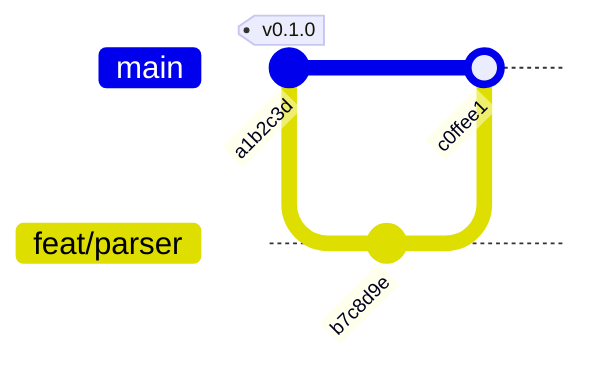

# Git: inspecting, committing, and getting out of trouble

Use when working in a repository: finding out what changed, making a commit, moving between
branches, and — the part that actually costs people work — undoing something without losing what
was never recorded anywhere.

## Which git verbs run where

`git` is classified per VERB, not as one program. That is the difference between "inspecting" and
"changing", and it decides whether a line runs, is asked about, or is refused.

| Group | Verbs | In plan mode (read-only) | In task mode |
| --- | --- | --- | --- |
| Inspect | `status`, `log`, `diff`, `show`, `branch`, `remote`, `tag`, `describe`, `rev-parse`, `blame`, `shortlog`, `ls-files`, `cat-file`, `config` (read), `grep`, `whatchanged`, `reflog`, `show-ref`, `for-each-ref`, `count-objects` | **allowed** | runs silently |
| Local change | `add`, `commit`, `checkout`, `switch`, `restore`, `stash`, `merge`, `rebase`, `init`, `clone`, `worktree`, `rm`, `mv` | **refused** | runs silently |
| Reaches out / rewrites | `push`, `pull`, `fetch`, `reset`, `clean`, `filter-branch`, `gc`, `submodule`, `cherry-pick` | **refused** | **the user is asked** |

`git push`, `git pull` and `git clone` authenticate through the login the user made in motita's
settings, in a session's worktree as much as in the main checkout (and the user's own git
configuration still applies). If one fails with "Authentication failed" or "could not read
Username", do not hunt for a token: tell the user to connect the host in Settings → Git
connections (web) or `/git connect` (terminal).

Two consequences worth knowing before you plan a step:

- **`git commit` runs without a confirmation; `git push` asks.** So a local commit is cheap and a
  push costs the user one keystroke — batch your pushes, and never push as a way of "saving".
- `git config` reads with one positional and writes with two: `git config user.name` reads,
  `git config user.name "X"` writes.

## Never trust the branch name you saw earlier

The working checkout can be moved by something else — another agent, another session, a person —
between the moment you looked and the moment you commit. Verify IMMEDIATELY before every commit,
and check that the last commit is the one you just made:

```sh
test "$(git branch --show-current)" = "$WANT" || exit 1
git log --oneline -1
```

Three traps this prevents, all of which have really happened:

- **`git switch -c name` FAILS when the branch already exists**, and a piped `| tail` swallows the
  error: you keep the branch you were on and commit onto someone else's. Never pipe the switch. If
  the branch exists, `git switch name` (no `-c`).
- **A branch is not exclusive.** git only refuses `git worktree add` on a branch already checked
  out; once that worktree moves elsewhere, any checkout can take the branch (exit 0) and lock the
  other holder out.
- **A `git merge --no-ff <branch>` while the checkout IS on `<branch>`** exits 0 with "Already up to
  date" — a silent false success. Check what is checked out first.

## Before a destructive step: make the work an object

**Uncommitted work is the only work with no recovery path.** If a tree is dirty and you are about to
clean, move or rebuild, capture it first. `git stash create` returns a commit WITHOUT touching the
working tree, so whoever owns those changes keeps working:

```sh
sha=$(git stash create "wip: what it is"); git tag -f backup/<label>-$(date +%s) "$sha"
```

For an UNTRACKED-inclusive snapshot, use a THROWAWAY index and never leave it exported — a leaked
`GIT_INDEX_FILE` makes every later `git status` report the whole repository as staged:

```sh
GIT_INDEX_FILE=$(mktemp) git read-tree HEAD && git add -A && git write-tree
```

A **bundle** is what survives a `gc`, and it must be re-made after new commits or it silently
becomes stale:

```sh
git bundle create /path/snap.bundle --all
git bundle list-heads /path/snap.bundle | grep "refs/heads/$b$"   # must equal: git rev-parse $b
```

`git bundle verify` only proves the bundle is self-consistent; a bundle made before your last
commit still verifies, still lists every ref, and is simply missing the work. **Prove a restore**:
clone it somewhere and compare `md5sum` of the files that changed. A listing is not evidence.

## Reading a repository before changing it

```sh
git status --short              # what is dirty, including untracked (a bare `git status` hides less)
git log --oneline -10            # what happened lately, and in what style
git diff                         # unstaged, and it shows ANOTHER writer's hunks too
git diff --cached                # what is already staged
git diff --stat HEAD             # the shape of the change, before reading it
```

**`git diff` in a shared checkout is not "my change".** Stage only your own hunks when others are
working in the same tree, and leave theirs in the working tree.

## Committing

- **Stage explicitly** (`git add <paths>`), not `git add -A`, when more than one writer shares the
  tree. `git add -A` is how a scratch file or another session's half-written test gets committed
  under your message.
- **Every commit subject is semantic: `type(scope): description`** (Conventional Commits: `feat`,
  `fix`, `docs`, `style`, `refactor`, `perf`, `test`, `build`, `ci`, `chore`, `revert`; `!` marks a
  breaking change). A `git commit -m` whose subject is not in that form is refused before the commit
  is made. The pull-requests-and-ci skill has the table and how to open a pull request.
- **Write the message about the change, not the session.** What the commit does, and why the
  non-obvious choice was made. A diary is not a commit message.
- **`git commit -F -` with a heredoc** is how to write a multi-paragraph message without shell
  quoting pain; `-m` with embedded newlines invites the shell to eat them.
- **Only git-tracked files are scanned** by a repository's own language/style gates. A new untracked
  file is not checked until it is staged, so run the gate on your files before committing rather
  than assuming CI will agree.

## Undoing, in order of least damage

| Want | Command | Note |
| --- | --- | --- |
| Unstage a file | `git restore --staged <path>` | keeps your edits |
| Discard unstaged edits | `git restore <path>` | **destroys them**; confirm the path |
| Discard staged and unstaged | `git restore --source=HEAD --staged --worktree <path>` | the full reset of one file |
| Move the last commit but keep the files | `git reset --soft HEAD~1` | commit is gone, work stays staged |
| Undo a commit that is already pushed | `git revert <sha>` | a NEW commit; safe on a shared branch |
| Change the last message | `git commit --amend` | never on a pushed commit without coordination |

`git reset --hard`, `git clean -fdx` and `git checkout -- .` are the ones that lose work, and all
three ask the user first. Read what they would remove (`git clean -ndx`, `git diff`) before running
them.

## Diagnosing "it went wrong"

- **Which branch am I on, really?** `git branch --show-current`, then `git log --oneline -1` — if the
  top commit is not yours, stop.
- **Where is that branch now?** `git reflog` is the history of HEAD itself, and it is how a branch
  lost to a bad `reset` gets found again.
- **Is this branch merged?** `git branch -d` SUCCEEDING is not proof of anything: for a
  squash-merged branch it also accepts "merged into its upstream", which is the same commit. Two
  tests that do mean something: identical trees (`git diff main <branch> --stat` empty) or the
  patch-id fingerprint of the change appearing in `main`.
- **Is a worktree in use?** `git worktree list --porcelain` reports registration, not activity. Ask
  the process table: `readlink /proc/<pid>/cwd`.
- **A `git worktree add` that fails on a missing directory** needs `git worktree prune` first — the
  registration is there but the directory is gone.

## Say what you changed

Report the branch, the commit sha and the files, from what the commands actually returned. "Fixed
the issue" is not reportable; "committed `a1b2c3d` on `fix/parser`, touching `parser.go` and its
test" is.

### Showing it: the branch graph, and the files that moved

A branch name in prose is one line of a picture the reader has to assemble themselves. Two things
carry it better, and both are cheap:

**The shape of the branches**, as a `gitGraph` in the answer when the interface renders diagrams.
Measured on this renderer: `gitGraph` draws commits, tags and branch labels. Put it in a fence
tagged `mermaid`, and read the real log for the ids rather than inventing them:



`gitGraph` is picky about one thing: do not `branch` the branch you are already on. It fails with
*Trying to create an existing branch* and the diagram draws nothing, which reads as "the feature
is broken" rather than "the syntax is wrong". `git log --oneline --graph --all` is the text
version, and it is what a terminal surface gets — see the `diagrams-and-reports` procedure for
which surface draws what.

**The files that moved**, as a table, from `git show --stat` (or `git diff --stat` for work not
yet committed) — never from memory, and never with a count you did not just read:

| file | + | − |
| --- | ---: | ---: |
| `internal/gitx/gitx.go` | 42 | 7 |
| `internal/gitx/gitx_test.go` | 61 | 0 |

For a squash merge or a branch that is already pushed, `git log --oneline main..<branch>` gives
the commits that are actually in it, and `git diff --stat <base>...<branch>` the total. `...`
(three dots) is the one you want against a base that has moved on: two dots reports every commit
the base gained since the fork as if the branch were removing them.

